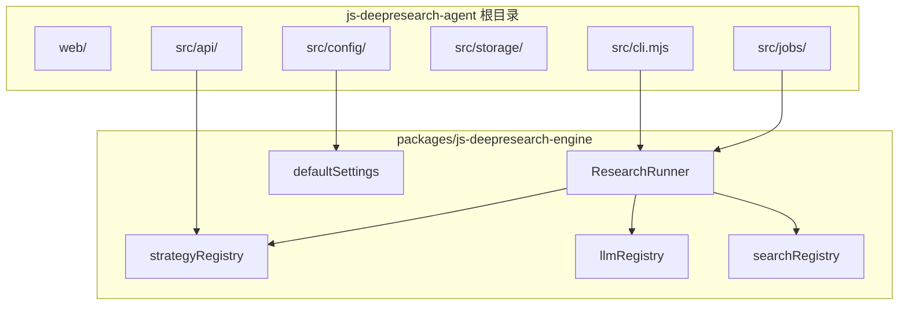

# js-deepresearch-engine 抽离：把调研运行时从 Agent 产品里拆出来

> 日期：2026-05-25
> 项目：js-deepresearch-agent / js-deepresearch-engine
> 类型：架构设计 / 功能实现 / 升级迁移
> 来源：Cursor Agent 对话

---

## 目录

1. [背景与动机](#1-背景与动机)
2. [分析过程](#2-分析过程)
3. [方案设计](#3-方案设计)
4. [实现要点](#4-实现要点)
5. [验证与测试](#5-验证与测试)
6. [后续演化](#6-后续演化)

---

## 1. 背景与动机

这次工作的起点，是一个架构层面的问题：当前仓库里，哪些是「可复用的深度调研引擎」，哪些只是「本地单用户 Agent 产品」？

`js-deepresearch-agent` 已经具备完整的研究链路——策略 registry、LLM/Search 适配器、`ResearchRunner`、报告合成。但它和 Express API、SQLite 持久化、Web UI、CLI 配置管理混在同一个 `src/` 里。如果第三方想在自己的脚本或服务里嵌入同样的调研能力，只能复制源码或依赖整个 agent 包。

真正要解决的问题不是「能不能拆目录」，而是：

- **engine** 只回答「怎么调研」；
- **agent** 只回答「怎么在本机跑起来并管理历史」。

目标产物是一个可独立发布的 npm 包 `js-deepresearch-engine`，agent 作为官方 reference app 继续留在仓库根目录。

## 2. 分析过程

顺着现有代码边界梳理，发现核心链路已经相对独立：

| 链路 | 关键模块 | 发现 |
| ---- | ---- | ---- |
| 调研入口 | `ResearchRunner` | 只依赖 LLM/Search 工厂和 `runStrategy()`，不碰 DB |
| 策略执行 | `strategies.mjs` | 已有 registry，返回统一 `findings` 形状 |
| 报告合成 | `report-builder.mjs` | 只消费 `findings`，与持久化无关 |
| LLM / Search | `provider-factory`、`search-factory` | 纯 `fetch` / `spawn`，无 Express/SQLite 依赖 |
| 应用外壳 | `JobRunner`、`SettingsStore`、`api/app.mjs` | 与 engine 通过 settings 对象耦合 |

关键结论是：**抽包条件已经成熟**。`ResearchRunner → runStrategy → buildReport` 是天然边界；LLM/Search 实现无 I/O 持久化依赖；findings 结构统一。

需要额外处理的耦合点：

| 耦合 | 位置 | 处理方式 |
| ---- | ---- | ---- |
| settings schema | `defaults.mjs` | 迁入 engine，作为 schema 唯一来源 |
| env 解析 | `env-overrides.mjs` | 留在 agent；`parseJsEyesSkills` 改从 engine 导入 |
| artifact 落盘 | `work-output.mjs` | 迁入 engine 作为 optional utility |
| factory 硬编码 | LLM/Search factory | 同步升级为 registry，避免抽包后再改一遍 |

## 3. 方案设计

最终采用 **原地分包 + workspace 联调 + 一次完成 registry 改造** 的路径。

### 仓库布局

```text
js-deepresearch-agent/          ← 根目录保留 agent 应用
├── packages/js-deepresearch-engine/   ← 新 engine 包
├── src/api、jobs、storage、config、cli
├── web/
└── tests/                     ← agent 集成测试
```

没有把整个 agent 移入 `packages/agent/`（备选 monorepo 双包布局），而是只在 `packages/` 下新增 engine，改动面更小。

### 职责划分

| 留在 agent | 迁入 engine |
| --- | --- |
| Express API、Web UI、CLI | `research/`（runner、strategies、prompts 等） |
| SQLite repositories、`JobRunner`、SSE | `llm/`、`search/` |
| `SettingsStore`、`env-overrides`、`.env` 加载 | `config/defaults.mjs`（schema） |
| | `work-output.mjs`（文件 artifact 工具） |

### Registry 改造

抽包与 registry 改造放在同一 PR 完成，避免「先搬目录、再改 factory」产生两次行为风险：

- `registerLlmProvider` / `createLlmProvider` — 内置 `openai-compatible`、`ollama`；`openrouter` 走 alias
- `registerSearchEngine` / `createSearchEngine` — 内置 `searxng`、`js-eyes`
- `registerStrategy` — 在已有 `strategyRegistry` 上补充注册 API

### 关键决策

| 决策 | 选择 | 理由 |
| ---- | ---- | ---- |
| 仓库组织 | 根目录 agent + `packages/engine` | 改动面小，workspace 仍可本地联调 |
| registry 时机 | 与搬迁同 PR 完成 | 避免二次改造和重复 review |
| engine 依赖 | 零 runtime 依赖 | 纯 Node ESM + 内置 `fetch`，便于第三方嵌入 |
| settings 边界 | engine 只认 plain object | 不读 `.env`、不碰 SQLite |
| 内置 adapter | 第一版全部内置 | 代码量不大；registry API 为后续插件化留口 |
| TypeScript | 暂不加构建链 | 用 JSDoc typedef 提供类型提示 |
| npm publish | 本阶段不执行 | 先稳定 workspace 内联调 |

目标架构：



## 4. 实现要点

### 项目结构

```text
packages/js-deepresearch-engine/
├── package.json
├── README.md
├── src/
│   ├── index.mjs              # 公开 API 入口
│   ├── types.mjs              # JSDoc typedef
│   ├── config/defaults.mjs
│   ├── research/              # runner、strategies、prompts 等 7 文件
│   ├── llm/                   # provider-factory + ollama/openai-compatible
│   └── search/                # search-factory + searxng/js-eyes
└── tests/                     # engine 单测 5 文件
```

根目录 agent 删除原 `src/research/`、`src/llm/`、`src/search/`，改为：

```javascript
import { ResearchRunner, mergeSettings, providerMetadata } from 'js-deepresearch-engine';
```

### 关键模块

| 文件 | 职责 |
| ---- | ---- |
| [`packages/js-deepresearch-engine/src/index.mjs`](../../packages/js-deepresearch-engine/src/index.mjs) | 稳定公开 API：runner、registry、settings、work-output |
| [`packages/js-deepresearch-engine/src/llm/provider-factory.mjs`](../../packages/js-deepresearch-engine/src/llm/provider-factory.mjs) | LLM registry + 内置 provider |
| [`packages/js-deepresearch-engine/src/search/search-factory.mjs`](../../packages/js-deepresearch-engine/src/search/search-factory.mjs) | Search registry + 内置 engine |
| [`packages/js-deepresearch-engine/src/research/strategies.mjs`](../../packages/js-deepresearch-engine/src/research/strategies.mjs) | 策略 registry + `registerStrategy` |
| [`src/jobs/job-runner.mjs`](../../src/jobs/job-runner.mjs) | 薄包装：调 engine.run → 写 DB / work_dir / SSE |
| [`src/config/env-overrides.mjs`](../../src/config/env-overrides.mjs) | env 映射；`parseJsEyesSkills` 从 engine 导入 |
| [`package.json`](../../package.json) | `workspaces: ["packages/*"]`，依赖 `"js-deepresearch-engine": "workspace:*"` |

### 公开 API 面（1.0 稳定）

| Export | 说明 |
| --- | --- |
| `ResearchRunner` | 主入口：`run({ query, settings, signal, onProgress, llm?, search? })` |
| `runStrategy`, `strategyMetadata`, `registerStrategy` | 策略 registry |
| `createLlmProvider`, `providerMetadata`, `registerLlmProvider` | LLM registry |
| `createSearchEngine`, `searchEngineMetadata`, `registerSearchEngine` | Search registry |
| `defaultSettings`, `mergeSettings` | Settings schema |
| `saveResearchToWorkDir` 等 | 文件 artifact 工具 |
| `parseJsEyesSkills` | 供 agent env 解析使用 |

## 5. 验证与测试

### 自动化测试

根目录执行：

```bash
npm install
npm test
npm run lint
```

结果：

| 范围 | 测试数 | 结果 |
| --- | --- | --- |
| engine（`packages/js-deepresearch-engine/tests/`） | 33 | 全部通过 |
| agent（根 `tests/`） | 14 | 全部通过 |
| ESLint | — | 通过 |

engine 测试覆盖：research-runner、search-executor、js-eyes、work-output、**registry**（新增）。

### 集成验证

CLI 启动正常：

```bash
npm exec jdr -- help
```

API 元数据路由正常（`/api/strategies` 返回三种内置策略）。

### 端到端深度调研

使用真实 LLM + SearXNG 配置执行一次 rapid 调研：

```bash
npm exec jdr -- research "Node.js 22 有哪些重要新特性" \
  --strategy rapid --questions 2 --concurrency 2 \
  --output work_dir\test-report.md
```

| 指标 | 结果 |
| --- | --- |
| 耗时 | 约 31 秒 |
| 搜索次数 | 3（原始问题 + 2 个 follow-up） |
| 报告 | 正常生成，含 Summary / Key Findings / Sources |
| Artifact | `work_dir\rapid\2026-05-25_101323\` |

说明 workspace 链接、engine 运行时、agent CLI 三层联调均正常。

## 6. 后续演化

| 方向 | 说明 |
| --- | --- |
| npm publish | engine 稳定后可独立发版；agent 声明 `engines: { "js-deepresearch-engine": "^1.0.0" }` |
| 插件化 | 将 js-eyes、Tavily 等拆为 optional packages，core 只保留接口 + registry |
| TypeScript | 若第三方集成增多，可补 `.d.ts` 或引入轻量 build |
| semver 约定 | findings/report 形状变更 = major；新增 strategy/provider = minor |
| agent 瘦身 | `JobRunner` 可进一步只做持久化/SSE，业务逻辑全部委托 engine |

---

## 附：本轮对话问题—思考—方案—执行对照

| 阶段 | 内容 |
| --- | --- |
| 问题 | 如何把框架部分抽离为独立 npm 包 `js-deepresearch-engine`，让第三方可嵌入调研能力 |
| 思考 | `ResearchRunner` 已是天然边界；需划清 engine（怎么调研）与 agent（怎么本机跑）职责；factory 应同步升级为 registry |
| 方案 | 根目录保留 agent，`packages/js-deepresearch-engine` 迁入 research/llm/search/defaults；workspace 联调；公开 API 冻结 |
| 执行 | 完成搬迁、registry 改造、import 切换、测试拆分（47 项通过）、文档更新；端到端 rapid 调研验证通过 |
