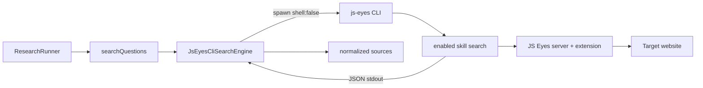

# JS Eyes 搜索 Provider：产品化 CLI 接入与跨平台 spawn 修复

> 日期：2026-05-25
> 项目：js-deepresearch-agent
> 类型：架构设计 / 功能实现 / 问题排查
> 来源：Cursor Agent 对话

---

## 目录

1. [背景与动机](#1-背景与动机)
2. [分析过程](#2-分析过程)
3. [方案设计](#3-方案设计)
4. [实现要点](#4-实现要点)
5. [验证与测试](#5-验证与测试)
6. [后续演化](#6-后续演化)

---

## 1. 背景与动机

这次工作的起点，是用户希望把 [`js-eyes`](https://github.com/imjszhang/js-eyes) 接进当前 deep research 项目，作为新的搜索 Provider。

当前项目（`js-deepresearch-agent`）的搜索边界很薄：`searchQuestions` 只要求 search 对象实现 `search(question, { signal })`，返回 `{ title, url, snippet, engine }[]`。现有 MVP 只有 SearXNG 适配器，适合通用网页检索，但不适合需要浏览器登录态、DOM 抽取的站点（知乎、小红书等）。

`js-eyes` 的价值不在 WebSocket SDK 本身，而在 skill 层已经封装了页面导航、bridge 注入、反爬判断和结果抽取。如果 deep research 项目直接 import `js-eyes` 源码或 workspace 包，会引入 Node 版本、CJS/ESM、依赖解析和浏览器生命周期管理等额外耦合。

所以真正要解决的问题不是「能不能搜」，而是：

**如何把 js-eyes 当成外部产品依赖接入，同时保持 deep research 项目自身的搜索接口不变。**

---

## 2. 分析过程

### 2.1 当前项目的搜索入口

| 模块 | 文件 | 职责 |
| ---- | ---- | ---- |
| Provider 工厂 | [`src/search/search-factory.mjs`](../../src/search/search-factory.mjs) | 注册 metadata、实例化搜索引擎 |
| 现有适配器 | [`src/search/engines/searxng.mjs`](../../src/search/engines/searxng.mjs) | HTTP 调用 SearXNG JSON API |
| 搜索执行 | [`src/research/search-executor.mjs`](../../src/research/search-executor.mjs) | 并发搜索、失败隔离、顺序保持 |
| 配置 | [`src/config/defaults.mjs`](../../src/config/defaults.mjs)、[`env-overrides.mjs`](../../src/config/env-overrides.mjs) | 默认项与环境变量映射 |

Research pipeline 不关心搜索后端是 HTTP 还是浏览器，只要 source 形状一致即可。这意味着新增 Provider 只需实现适配层，不必改 runner 或 report builder。

### 2.2 js-eyes 侧的产品化边界

`js-eyes` 已提供稳定 CLI 入口：

| 能力 | 命令 | 用途 |
| ---- | ---- | ---- |
| 健康检查 | `js-eyes doctor --json` | 机器可读诊断 |
| 搜索执行 | `js-eyes skill run <skillId> search <query> ...` | 调用已启用 skill |
| Skill 管理 | `js-eyes skills enable <skillId>` | 启用目标 skill |

Skill CLI（如 `js-zhihu-ops-skill`、`js-xiaohongshu-ops-skill`）会把结果以 JSON 写到 stdout，stderr 留给诊断日志。这与 deep research 项目「spawn 子进程、读 stdout、归一化 source」的模型天然匹配。

### 2.3 被否定的方案

| 方案 | 为什么不选 |
| ---- | ---------- |
| 直接 import `@js-eyes/client-sdk` 或 skill contract | 重复实现 Session/bridge 逻辑；Node/workspace 边界复杂 |
| 每次搜索前强制 `doctor --json` | 多问题并发时开销过大 |
| 在 deep research 内自动安装/启动 js-eyes | 超出 Provider 职责；运维边界不清 |
| Windows 上 `shell: true` 拼命令 | 有注入风险，与项目 spawn 安全习惯不一致 |

---

## 3. 方案设计

最终采用 **产品化 CLI 适配器**：deep research 只负责调用 `js-eyes skill run`，解析 JSON，映射为统一 source 结构；浏览器、扩展、登录、skill 生命周期仍由 js-eyes 管理。



### 关键决策

| 决策 | 选择 | 理由 |
| ---- | ---- | ---- |
| 集成方式 | 外部 CLI + JSON stdout | 边界清晰，不依赖 js-eyes 源码 |
| 第一版 skill | 单 skill 单 command（默认知乎 `search`） | 最小可用，避免多站点聚合复杂度 |
| 健康检查 | 失败时提示跑 `doctor --json`，不每次预检 | 平衡可靠性与并发开销 |
| Windows spawn | PATH 解析 `.cmd` + `cmd.exe /c` 包装 | Node 不能直接 spawn `.cmd` |
| Unix spawn | PATH 查找可执行文件并检查 `X_OK` | 与 npm global bin 习惯一致 |
| 配置 | `JS_EYES_*` 环境变量 + defaults | 与现有 SearXNG 配置模式一致 |

默认命令形态：

```bash
js-eyes skill run js-zhihu-ops-skill search "<query>" --limit 8 --quiet --max-pages 1 --ws-endpoint ws://localhost:18080
```

结果归一化规则：

- 知乎：优先读 `result.data.items[]`
- 小红书：优先读 `result.notes[]` / `result.items[]`
- 映射：`title`、`url`（必填）、`snippet`、`engine`（如 `js-eyes:zhihu`）

---

## 4. 实现要点

### 项目结构

```
src/search/
├── search-factory.mjs          # 注册 js-eyes metadata 与工厂分支
└── engines/
    ├── searxng.mjs
    └── js-eyes.mjs             # JsEyesCliSearchEngine（新增）

tests/
└── js-eyes-search-engine.test.mjs

.env.example / README.md        # JS_EYES_* 配置说明
```

### 关键模块

| 文件 | 职责 |
| ---- | ---- |
| [`src/search/engines/js-eyes.mjs`](../../src/search/engines/js-eyes.mjs) | 拼 argv、spawn CLI、解析 JSON、归一化 source；导出 `resolveCliCommand` / `resolveSpawnTarget` |
| [`src/search/search-factory.mjs`](../../src/search/search-factory.mjs) | 增加 `js-eyes` metadata（`requiresBrowser: true`）和工厂分支 |
| [`src/config/defaults.mjs`](../../src/config/defaults.mjs) | 默认 `jsEyesCli`、`jsEyesSkill`、`jsEyesCommand` 等 |
| [`src/config/env-overrides.mjs`](../../src/config/env-overrides.mjs) | 映射 `JS_EYES_CLI`、`JS_EYES_SKILL`、`JS_EYES_SERVER_URL` 等 |
| [`tests/js-eyes-search-engine.test.mjs`](../../tests/js-eyes-search-engine.test.mjs) | mock 子进程 + 跨平台 CLI 解析测试 |

### 跨平台 spawn 逻辑

这是联调阶段暴露出的真实问题，也是后续维护的重点：

| 平台 | CLI 解析 | 启动方式 |
| ---- | -------- | -------- |
| Linux/macOS | 在 `PATH` 中找可执行文件，检查 `X_OK` | 直接 `spawn(executable, args)` |
| Windows | 在 `PATH` 中找 `js-eyes.cmd` / `.exe` / `.bat` | `spawn(cmd.exe, ['/d','/s','/c', shim, ...args])` |

`.env` 不再需要写死 Windows 绝对路径；只有 CLI 不在 `PATH` 时才设置 `JS_EYES_CLI=/usr/local/bin/js-eyes` 这类绝对路径。

### 配置示例

```bash
SEARCH_ENGINE=js-eyes
JS_EYES_SKILL=js-zhihu-ops-skill
JS_EYES_SERVER_URL=ws://localhost:18080
JS_EYES_MAX_PAGES=1
JS_EYES_TIMEOUT_MS=120000
```

前置条件（不由 deep research 自动处理）：

1. 安装 `js-eyes` CLI
2. 启动 server：`js-eyes server start`
3. 浏览器扩展已连接
4. 启用 skill：`js-eyes skills enable js-zhihu-ops-skill`
5. 目标站点已登录（如知乎）

---

## 5. 验证与测试

### 单元测试

```bash
npm test
npm run lint
node --test tests/js-eyes-search-engine.test.mjs
```

结果：

- 全量测试 **28/28 通过**
- ESLint 通过
- JS Eyes 专项测试覆盖：知乎/小红书映射、非 0 退出、非法 JSON、abort、timeout、Unix/Windows CLI 解析

### 配置加载验证

```bash
node --input-type=module -e "
  import './src/config/bootstrap-env.mjs';
  import { settingsFromEnv } from './src/config/env-overrides.mjs';
  import { loadEnv } from './src/config/load-env.mjs';
  loadEnv(process.cwd());
  console.log(JSON.stringify(settingsFromEnv(), null, 2));
"
```

确认 `SEARCH_ENGINE=js-eyes` 与 `JS_EYES_*` 正确映射。

### 联调排查与正式跑通

联调过程中暴露了三类「报告生成了但没有来源」的假象：

| 现象 | 根因 | 处理 |
| ---- | ---- | ---- |
| `sources.json` 为空，报告仍有内容 | Node `spawn js-eyes ENOENT` | Windows PATH 解析 + `.cmd` 包装 |
| WebSocket 连不上 | `ws://127.0.0.1:18080` 失败，`localhost` 可用 | `.env` 改用 `ws://localhost:18080` |
| 搜索成功但 0 条结果 | 知乎对某些关键词 DOM 为空 | 换更通用的 query（如「人工智能大模型的最新应用」） |

正式跑通的一次调研：

```bash
js-eyes skills enable js-zhihu-ops-skill

npm exec jdr -- research "人工智能大模型的最新应用" \
  --strategy rapid --iterations 1 --questions 2 --concurrency 1 \
  --output work_dir/js-eyes-research-report-with-sources.md
```

产物：

- 报告：`work_dir/js-eyes-research-report-with-sources.md`
- 会话目录：`work_dir/rapid/2026-05-25_052354/`
- `sources.json` 含 **24 条知乎链接**，报告引用了真实来源

Provider 直调验证（Windows，自动解析 CLI）：

```text
resolved: d:\nvm4w\nodejs\js-eyes.cmd
spawn: C:\WINDOWS\system32\cmd.exe
count: 8
```

---

## 6. 后续演化

| 方向 | 说明 |
| ---- | ---- |
| 多 profile 预设 | 在 settings 中支持 `zhihu` / `xhs` 等预设，而不只配 skillId |
| 预检开关 | 可选 `jsEyesPreflight=true`，job 首次搜索前跑 `doctor --json` |
| 来源清洗 | 过滤知乎「相关搜索」等非内容 URL |
| `source-based` 全量联调 | 多轮 + 多问题场景下的耗时与并发控制 |
| API 诊断端点 | 可选 `/api/search-engines/js-eyes/doctor` 供 Web UI 展示 readiness |
| 小红书 skill | 切换 `JS_EYES_SKILL=js-xiaohongshu-ops-skill` 并验证映射 |

第一版刻意不做的事：不 import js-eyes 源码、不自动安装 skill、不自动启动 server、不做多站点聚合排序。

---

## 附：本轮对话问题—思考—方案—执行对照

| 阶段 | 内容 |
| ---- | ---- |
| 问题 | 如何把 js-eyes 作为新搜索 Provider 接入 deep research 项目 |
| 思考 | 项目搜索接口很薄，适合外部适配；js-eyes 的价值在 skill/CLI 而非 SDK 直连；产品化边界应留在 js-eyes 侧 |
| 方案 | 新增 `JsEyesCliSearchEngine`，通过 `js-eyes skill run` 读 JSON stdout；配置走 `JS_EYES_*`；Windows/Unix 分别处理 CLI 解析与 spawn |
| 执行 | 实现适配器、工厂注册、配置、测试、文档；`.env` 切到 js-eyes；联调修复 spawn 与 localhost；正式调研跑通并产出 24 条知乎来源 |
