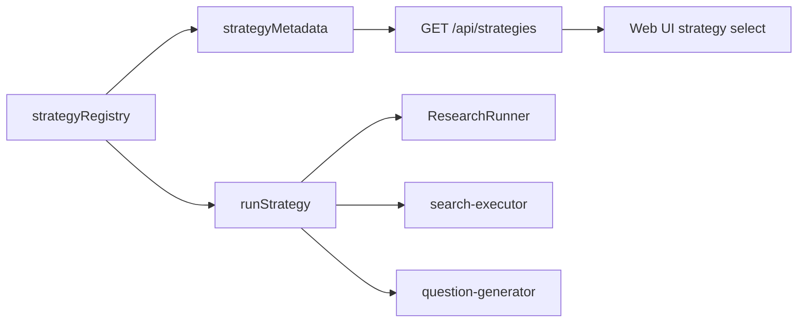

# 深度调研策略 Registry 与 Rapid 对齐：从硬编码分发到解耦执行

> 日期：2026-05-25
> 项目：js-deepresearch-agent
> 类型：架构设计 / 功能实现 / 调研分析
> 来源：Cursor Agent 对话

---

## 目录

1. [背景与动机](#1-背景与动机)
2. [分析过程](#2-分析过程)
3. [方案设计](#3-方案设计)
4. [实现要点](#4-实现要点)
5. [验证与测试](#5-验证与测试)
6. [后续演化](#6-后续演化)

---

## 1. 背景与动机

这次工作的起点，是一个看起来很简单的问题：当前项目到底有哪些深度调研策略？

顺着这个问题继续追问，就会发现真正的问题不是“有没有策略”，而是“策略是不是一个可以持续扩展的系统边界”。

项目里现在保留三种策略，但语义已经进一步对齐 `local-deep-research`：

| 策略 | 行为 |
| ---- | ---- |
| `rapid` | 搜索原始问题，再生成少量 follow-up questions，快速收集证据后统一综合 |
| `source-based` | 多轮生成 source-informed follow-up questions，每轮搜索可受控并发 |
| `parallel` | 面向广度和速度，生成问题后以受控并发执行搜索 |

这些策略已经通过统一的 `findings` 数据结构接入报告生成流程，说明核心执行链路有一定解耦。但最初策略选择本身还停留在 `if/else` 分发，Web UI 的选项也写死在前端。

第一步通过 registry 解决了“有哪些策略”的问题。随后又发现一个更深的问题：当前项目源自 `local-deep-research`，但本地策略里有一个 `quick`，而来源项目中对应的是 `rapid`。继续保留 `quick` 会制造本项目独有概念，反而让策略体系更难理解。

所以第二步不是简单改名，而是把 `quick` 的语义升级为 `rapid`：快速，但不再只是单次搜索。

## 2. 分析过程

分析时重点看了三条链路：

| 链路 | 关键文件 | 发现 |
| ---- | ---- | ---- |
| 策略执行 | `src/research/strategies.mjs` | 策略集中在单文件，通过 `if/else` 分发 |
| 调度入口 | `src/research/research-runner.mjs` | 只调用 `runStrategy()`，不依赖具体策略 |
| 前端入口 | `web/src/research.mjs` | 策略下拉框硬编码了三个选项 |

关键结论是：项目不是完全耦合。

`ResearchRunner` 只关心 `runStrategy()` 返回的 `findings`，`buildReport()` 也只消费这个结构。这是一个已经存在的好边界。真正需要处理的是策略发现与策略选择：现在策略没有自己的元数据，也没有统一 registry。

对比搜索引擎和 LLM provider 的实现，项目已经有类似的元数据模式。例如搜索引擎通过 `searchEngineMetadata` 暴露给 API 和 UI。策略应该跟随同样的模式，而不是另起一套风格。

第二轮分析又对照了 `d:\github\fork\local-deep-research`。其中 `rapid`、`source-based`、`parallel` 都有直接对应，但实现更成熟：

| 来源项目策略 | 当前项目吸收的设计 |
| ---- | ---- |
| `RapidSearchStrategy` | 原始查询 + 少量 follow-up questions + 最终综合 |
| `SourceBasedSearchStrategy` | 多轮搜索，后续问题基于已有来源继续生成 |
| `ParallelSearchStrategy` | 每轮问题并发执行，但并发应该受配置控制 |

这里真正要解耦的不是“策略文件要不要拆成很多个”，而是策略本身不要重复承担系统能力。搜索执行、并发限制、错误隔离、问题生成 prompt，都应该是共享基础设施。

## 3. 方案设计

最终分两步演进。

第一步选择轻量 registry 方案。

核心思想是：策略仍然留在 `src/research/strategies.mjs`，但不再用散落的条件分支表达“有哪些策略”。每个策略注册为一个条目，包含：

- `id`
- `label`
- `description`
- `run`

这样策略执行和策略展示都从同一个来源派生。

第二步把策略运行过程中的公共能力抽出：

- `search-executor` 负责搜索单个问题、批量搜索、并发限制和错误隔离。
- `question-generator` 负责不同模式的问题生成，包括 `initial`、`followup`、`rapid`。
- 策略函数只负责组织研究流程：何时生成问题、何时搜索、如何安排轮次。

### 关键决策

| 决策 | 选择 | 理由 |
| ---- | ---- | ---- |
| 策略组织方式 | 使用 `strategyRegistry` | 用最小改动建立统一扩展点 |
| UI 选项来源 | 新增 `/api/strategies` | 避免前端继续硬编码策略列表 |
| 未知策略处理 | 明确抛错 | 避免静默回退导致配置错误被掩盖 |
| `quick` 处理 | 直接替换为 `rapid` | 与来源项目语义对齐，不保留本地私有概念 |
| 公共搜索能力 | 抽出 `search-executor.mjs` | 避免策略重复实现并发、失败处理和结果形状 |
| 问题生成 | 扩展为多模式生成 | `rapid`、`source-based`、`parallel` 共享问题生成入口 |
| 迭代与并发 | 接入 `iterations` 和 `concurrency` | 让已有配置真正参与策略行为 |
| 是否拆多文件 | 暂不拆分 | 当前只有三个策略，单文件 registry 更贴合现有项目规模 |
| 是否引入插件系统 | 不引入 | 当前需求是可扩展入口，不是运行时插件加载 |

新的数据流如下：



这个方案保留了原有执行模型，同时让“新增策略”变成一个更清晰的动作：注册一个策略条目，并复用公共执行组件，而不是在每个策略里复制搜索和问题生成逻辑。

## 4. 实现要点

### 项目结构

```text
js-deepresearch-agent/
├── src/
│   ├── api/
│   │   └── app.mjs
│   └── research/
│       ├── question-generator.mjs
│       ├── search-executor.mjs
│       ├── research-runner.mjs
│       └── strategies.mjs
├── tests/
│   ├── research-runner.test.mjs
│   └── search-executor.test.mjs
└── web/
    └── src/
        └── research.mjs
```

### 关键模块

| 文件 | 职责 |
| ---- | ---- |
| `src/research/strategies.mjs` | 注册 `rapid`、`source-based`、`parallel`，组织策略流程 |
| `src/research/search-executor.mjs` | 统一批量搜索、并发限制、失败隔离和结果顺序 |
| `src/research/question-generator.mjs` | 统一生成 initial、followup、rapid 三类搜索问题 |
| `src/research/prompts.mjs` | 为不同问题生成模式提供 prompt |
| `src/api/app.mjs` | 新增 `GET /api/strategies`，向前端暴露策略元数据 |
| `web/src/research.mjs` | 从 `/api/strategies` 获取策略选项，并提交 iterations/concurrency |
| `src/cli.mjs` | 支持 `--iterations`、`--questions`、`--concurrency` 等策略参数 |
| `tests/research-runner.test.mjs` | 覆盖 rapid 行为、策略元数据、source-based 多轮和未知策略报错 |
| `tests/search-executor.test.mjs` | 覆盖并发限制、顺序保持和搜索失败隔离 |

### 策略 Registry

策略条目现在统一注册：

```js
export const strategyRegistry = {
  rapid: {
    id: 'rapid',
    label: 'Rapid',
    description: 'Search the original query and a few fast follow-up questions before synthesis.',
    requiresLlm: true,
    supportsIterations: false,
    supportsConcurrency: true,
    speed: 'fast',
    depth: 'light',
    run: runRapid,
  },
  'source-based': {
    id: 'source-based',
    label: 'Source Based',
    description: 'Iteratively generate source-informed questions and search with controlled concurrency.',
    requiresLlm: true,
    supportsIterations: true,
    supportsConcurrency: true,
    speed: 'balanced',
    depth: 'deep',
    run: runSourceBased,
  },
  parallel: {
    id: 'parallel',
    label: 'Parallel',
    description: 'Generate focused research questions and search them with higher concurrency.',
    requiresLlm: true,
    supportsIterations: true,
    supportsConcurrency: true,
    speed: 'fast',
    depth: 'broad',
    run: runParallel,
  },
};
```

元数据仍然从 registry 派生，但现在不只暴露名称，也暴露策略能力：

```js
export const strategyMetadata = Object.values(strategyRegistry).map(({ id, label, description }) => ({
  id,
  label,
  description,
}));
```

实际实现中还会从 registry 派生 `requiresLlm`、`supportsIterations`、`supportsConcurrency`、`speed`、`depth`，让 UI 和后续调用方不需要猜策略能力。

执行入口只做查表和调用：

```js
export async function runStrategy({ strategy, ...context }) {
  const entry = strategyRegistry[strategy];
  if (!entry) {
    throw new Error(`Unsupported research strategy: ${strategy}`);
  }
  return entry.run(context);
}
```

### 搜索执行器

`search-executor.mjs` 是第二阶段解耦的核心。它把搜索执行从策略里拿出来：

```js
export async function searchQuestions({
  questions,
  search,
  signal,
  concurrency = 1,
  onProgress = () => {},
}) {
  const uniqueQuestions = uniqueNonEmptyStrings(questions);
  if (uniqueQuestions.length === 0) return [];

  const maxConcurrency = normalizeConcurrency(concurrency, uniqueQuestions.length);
  const results = new Array(uniqueQuestions.length);
  // ...
}
```

这个模块承担四个职责：

| 职责 | 说明 |
| ---- | ---- |
| 去重 | 空问题和重复问题不进入搜索 |
| 并发控制 | `settings.research.concurrency` 在这里生效 |
| 错误隔离 | 单个问题搜索失败只返回空 sources，不中断整轮研究 |
| 顺序保持 | 并发完成顺序不影响最终结果顺序 |

### 策略语义

三种策略现在的边界更清楚：

| 策略 | 定位 | 当前行为 |
| ---- | ---- | ---- |
| `rapid` | 快速研究 | 原始 query + 最多 3 个 follow-up questions，一轮搜索 |
| `source-based` | 默认深度研究 | 使用 `iterations` 多轮生成问题，后续轮次基于已有 sources 继续追问 |
| `parallel` | 快速广度研究 | 多轮生成问题，以 `concurrency` 控制并行搜索 |

### API 和 UI

API 新增策略元数据接口：

```js
app.get('/api/strategies', (_req, res) => {
  res.json(strategyMetadata);
});
```

Web UI 启动时并行读取策略列表：

```js
const [settings, providers, searchEngines, strategies] = await Promise.all([
  apiGet('/api/settings'),
  apiGet('/api/providers'),
  apiGet('/api/search-engines'),
  apiGet('/api/strategies'),
]);
```

策略下拉框改成动态渲染：

```js
<select id="strategy">${options(strategies, settings.research.strategy)}</select>
```

同时 Web UI 增加了 `Iterations` 和 `Concurrency` 输入，CLI 也支持：

```bash
npm exec jdr -- research "query" --strategy source-based --iterations 2 --questions 3 --concurrency 2
```

## 5. 验证与测试

完成后做了三类验证。

第一类是编辑文件的 lint 诊断：

```text
ReadLints: No linter errors found.
```

覆盖文件：

- `src/research/strategies.mjs`
- `src/research/search-executor.mjs`
- `src/research/question-generator.mjs`
- `src/api/app.mjs`
- `web/src/research.mjs`
- `tests/research-runner.test.mjs`
- `tests/search-executor.test.mjs`

第二类是项目测试：

```bash
npm test
```

结果：

```text
# tests 16
# suites 6
# pass 16
# fail 0
```

第三类是 ESLint：

```bash
npm run lint
```

结果：通过。

新增测试覆盖了几个关键行为：

| 测试 | 意义 |
| ---- | ---- |
| `runs rapid research with injected LLM and search adapters` | 确认 `rapid` 会搜索原始 query 和 follow-up questions |
| `exposes available research strategies as metadata` | 确认 UI/API 可以从统一元数据拿到策略列表 |
| `runs source-based research across configured iterations` | 确认 `source-based` 真正使用 `iterations` |
| `rejects unsupported research strategies` | 确认未知策略不会再静默回退 |
| `limits concurrent searches and preserves result order` | 确认搜索执行器按 `concurrency` 限流并保持顺序 |
| `keeps failed searches scoped to their question` | 确认单个搜索失败不会拖垮整轮研究 |

## 6. 后续演化

这个改动已经解决了两个问题：策略入口可扩展，以及现有三种策略的基础执行能力解耦。

后续可以继续做几件事：

1. 增加 relevance filter，在报告合成前对 sources 做相关性筛选和重排。
2. 当策略数量继续增加时，把每个策略拆成独立文件，例如 `strategies/rapid.mjs`、`strategies/parallel.mjs`。
3. 将 `questionsByIteration`、`strategyStats` 作为结构化结果返回，方便 UI 展示研究过程。
4. 在 `/api/strategies` 的能力描述基础上，让 Web UI 对不同策略显示更具体的提示。
5. 继续评估 `focused-iteration` 是否适合引入，但不要直接搬 `mcp`、`langgraph-agent` 这类重型策略。

---

## 附：本轮对话问题—思考—方案—执行对照

| 阶段 | 内容 |
| ---- | ---- |
| 问题 | 当前项目有哪些深度调研策略？策略是否解耦？是否支持新增？是否应该与 `local-deep-research` 语义对齐？ |
| 思考 | 执行链路已经通过 `findings` 契约解耦，但策略选择、问题生成、搜索执行和 UI 展示仍有耦合 |
| 方案 | 引入 `strategyRegistry` / `strategyMetadata`，将 `quick` 替换为 `rapid`，抽出 `search-executor`，扩展问题生成模式 |
| 执行 | 修改策略模块、问题生成器、搜索执行器、API/UI/CLI 和测试；`npm test` 16 个测试通过，`npm run lint` 通过 |
