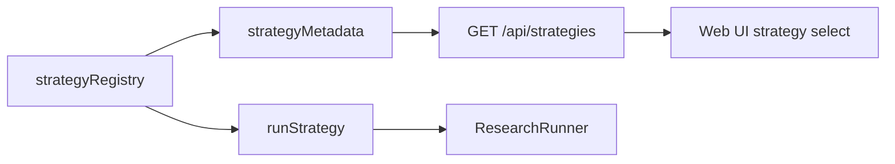

# 深度调研策略 Registry：从硬编码分发到可扩展入口

> 日期：2026-05-25
> 项目：js-deepresearch-agent
> 类型：架构设计 / 功能实现 / 调研分析
> 来源：Cursor Agent 对话

---

## 目录

1. [背景与动机](#1-背景与动机)
2. [分析过程](#2-分析过程)
3. [方案设计](#3-方案设计)
4. [实现要点](#4-实现要点)
5. [验证与测试](#5-验证与测试)
6. [后续演化](#6-后续演化)

---

## 1. 背景与动机

这次工作的起点，是一个看起来很简单的问题：当前项目到底有哪些深度调研策略？

顺着这个问题继续追问，就会发现真正的问题不是“有没有策略”，而是“策略是不是一个可以持续扩展的系统边界”。

项目里已经有三种策略：

| 策略 | 行为 |
| ---- | ---- |
| `quick` | 直接搜索原始问题，速度最快 |
| `source-based` | 用 LLM 拆分搜索问题，再串行搜索 |
| `parallel` | 用 LLM 拆分搜索问题，再并行搜索 |

这些策略已经通过统一的 `findings` 数据结构接入报告生成流程，说明核心执行链路有一定解耦。但策略选择本身还停留在 `if/else` 分发，Web UI 的选项也写死在前端。

这意味着：能加新策略，但每次都要手动改多个位置。策略越多，这个入口越容易变成维护负担。

## 2. 分析过程

分析时重点看了三条链路：

| 链路 | 关键文件 | 发现 |
| ---- | ---- | ---- |
| 策略执行 | `src/research/strategies.mjs` | 策略集中在单文件，通过 `if/else` 分发 |
| 调度入口 | `src/research/research-runner.mjs` | 只调用 `runStrategy()`，不依赖具体策略 |
| 前端入口 | `web/src/research.mjs` | 策略下拉框硬编码了三个选项 |

关键结论是：项目不是完全耦合。

`ResearchRunner` 只关心 `runStrategy()` 返回的 `findings`，`buildReport()` 也只消费这个结构。这是一个已经存在的好边界。真正需要处理的是策略发现与策略选择：现在策略没有自己的元数据，也没有统一 registry。

对比搜索引擎和 LLM provider 的实现，项目已经有类似的元数据模式。例如搜索引擎通过 `searchEngineMetadata` 暴露给 API 和 UI。策略应该跟随同样的模式，而不是另起一套风格。

## 3. 方案设计

最终选择了轻量 registry 方案。

核心思想是：策略仍然留在 `src/research/strategies.mjs`，但不再用散落的条件分支表达“有哪些策略”。每个策略注册为一个条目，包含：

- `id`
- `label`
- `description`
- `run`

这样策略执行和策略展示都从同一个来源派生。

### 关键决策

| 决策 | 选择 | 理由 |
| ---- | ---- | ---- |
| 策略组织方式 | 使用 `strategyRegistry` | 用最小改动建立统一扩展点 |
| UI 选项来源 | 新增 `/api/strategies` | 避免前端继续硬编码策略列表 |
| 未知策略处理 | 明确抛错 | 避免静默回退导致配置错误被掩盖 |
| 是否拆多文件 | 暂不拆分 | 当前只有三个策略，单文件 registry 更贴合现有项目规模 |
| 是否引入插件系统 | 不引入 | 当前需求是可扩展入口，不是运行时插件加载 |

新的数据流如下：



这个方案保留了原有执行模型，同时让“新增策略”变成一个更清晰的动作：注册一个策略条目，而不是记住所有需要同步修改的位置。

## 4. 实现要点

### 项目结构

```text
js-deepresearch-agent/
├── src/
│   ├── api/
│   │   └── app.mjs
│   └── research/
│       ├── research-runner.mjs
│       └── strategies.mjs
├── tests/
│   └── research-runner.test.mjs
└── web/
    └── src/
        └── research.mjs
```

### 关键模块

| 文件 | 职责 |
| ---- | ---- |
| `src/research/strategies.mjs` | 新增 `strategyRegistry`、`strategyMetadata`，并用 registry 分发策略 |
| `src/api/app.mjs` | 新增 `GET /api/strategies`，向前端暴露策略元数据 |
| `web/src/research.mjs` | 从 `/api/strategies` 获取策略选项，替代硬编码数组 |
| `tests/research-runner.test.mjs` | 增加策略元数据和未知策略报错测试 |

### 策略 Registry

策略条目现在统一注册：

```js
export const strategyRegistry = {
  quick: {
    id: 'quick',
    label: 'Quick',
    description: 'Search the original query once before synthesizing a report.',
    run: runQuick,
  },
  'source-based': {
    id: 'source-based',
    label: 'Source Based',
    description: 'Generate focused research questions and search them sequentially.',
    run: runSourceBased,
  },
  parallel: {
    id: 'parallel',
    label: 'Parallel',
    description: 'Generate focused research questions and search them in parallel.',
    run: runParallel,
  },
};
```

元数据从 registry 派生：

```js
export const strategyMetadata = Object.values(strategyRegistry).map(({ id, label, description }) => ({
  id,
  label,
  description,
}));
```

执行入口只做查表和调用：

```js
export async function runStrategy({ strategy, ...context }) {
  const entry = strategyRegistry[strategy];
  if (!entry) {
    throw new Error(`Unsupported research strategy: ${strategy}`);
  }
  return entry.run(context);
}
```

### API 和 UI

API 新增策略元数据接口：

```js
app.get('/api/strategies', (_req, res) => {
  res.json(strategyMetadata);
});
```

Web UI 启动时并行读取策略列表：

```js
const [settings, providers, searchEngines, strategies] = await Promise.all([
  apiGet('/api/settings'),
  apiGet('/api/providers'),
  apiGet('/api/search-engines'),
  apiGet('/api/strategies'),
]);
```

策略下拉框改成动态渲染：

```js
<select id="strategy">${options(strategies, settings.research.strategy)}</select>
```

## 5. 验证与测试

完成后做了两类验证。

第一类是编辑文件的 lint 诊断：

```text
ReadLints: No linter errors found.
```

覆盖文件：

- `src/research/strategies.mjs`
- `src/api/app.mjs`
- `web/src/research.mjs`
- `tests/research-runner.test.mjs`

第二类是项目测试：

```bash
npm test
```

结果：

```text
# tests 13
# suites 5
# pass 13
# fail 0
```

新增测试覆盖了两个关键行为：

| 测试 | 意义 |
| ---- | ---- |
| `exposes available research strategies as metadata` | 确认 UI/API 可以从统一元数据拿到策略列表 |
| `rejects unsupported research strategies` | 确认未知策略不会再静默回退 |

## 6. 后续演化

这个改动解决的是“策略入口可扩展”的问题，还没有把深度调研能力本身推进到更复杂阶段。

后续可以继续做几件事：

1. 把 `iterations` 真正接入策略逻辑，支持多轮搜索、反思和补充查询。
2. 把 `concurrency` 接入 `parallel` 策略，避免一次性并发过多搜索请求。
3. 当策略数量继续增加时，把每个策略拆成独立文件，例如 `strategies/quick.mjs`、`strategies/parallel.mjs`。
4. 给 `/api/strategies` 增加策略能力描述，例如是否需要 LLM、是否并行、是否支持迭代。
5. 给 CLI help 增加可用策略说明，避免用户只能从 Web UI 看到完整列表。

---

## 附：本轮对话问题—思考—方案—执行对照

| 阶段 | 内容 |
| ---- | ---- |
| 问题 | 当前项目有哪些深度调研策略？策略是否解耦？是否支持新增？ |
| 思考 | 执行链路已经通过 `findings` 契约解耦，但策略选择和 UI 展示仍是硬编码 |
| 方案 | 引入 `strategyRegistry` 和 `strategyMetadata`，并通过 `/api/strategies` 暴露给前端 |
| 执行 | 修改策略模块、API、Web UI 和测试；`ReadLints` 无错误，`npm test` 13 个测试通过 |
