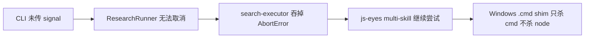
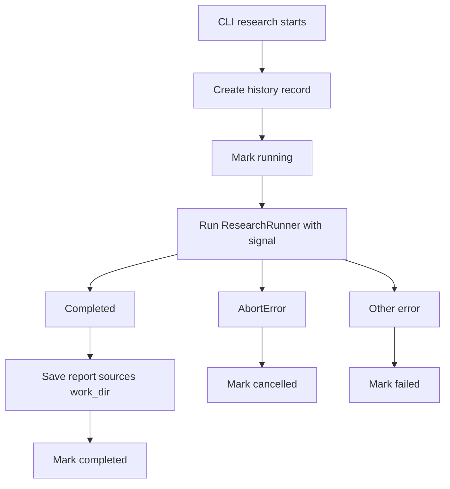

# Ctrl+C 停不住调研？给 CLI 补上真正的取消链路

> 日期：2026-05-26
> 项目：js-deepresearch-agent
> 类型：功能实现 / 问题排查
> 来源：Cursor Agent 对话

---

## 目录

1. [背景与动机](#1-背景与动机)
2. [分析过程](#2-分析过程)
3. [方案设计](#3-方案设计)
4. [实现要点](#4-实现要点)
5. [验证与测试](#5-验证与测试)
6. [后续演化](#6-后续演化)

---

## 1. 背景与动机

用户通过 `npm exec jdr -- research "deep research"` 在 Reddit 上跑深度调研时，按 Ctrl+C 以为已经中止，但 **js-eyes 仍在不停打开 Reddit 页面**。

真正的问题不是「浏览器没关」，而是 **CLI 取消语义缺失**：

- 前台 `research` 没有 `AbortController`，中断信号进不了 engine。
- 历史记录在完成后才写入 SQLite，运行中看不到 `running`，取消后也无法标记 `cancelled`。
- Web UI 的 `JobRunner.cancel()` 已有取消能力，CLI 路径却一直裸跑 `ResearchRunner.run()`。

这次工作的目标：让前台 CLI 调研具备与 Web UI 一致的可靠取消能力——按一次 Ctrl+C 停止后续 LLM / 搜索 / js-eyes 子进程，历史正确标记为 `cancelled`。

---

## 2. 分析过程

### 2.1 现象与误判

| 用户感知 | 实际发生 |
| -------- | -------- |
| 「已中止调研」 | Cursor 终端中断 shell 会话，底层 `jdr` Node 进程在 Windows 上未必被杀死 |
| 「js-eyes 还在开页」 | `source-based` 默认 2 轮 × 多子问题 ≈ 7 次 Reddit 搜索，每次 `open_url`；队列里的搜索会继续跑完 |
| 历史无 `cancelled` | 旧 CLI 完成后才 `create()` 记录，取消时根本没有 `running` 状态可更新 |

审计日志显示：最后一次 `open_url` 约在调研完成前 1 分钟停止——不是 js-eyes「卡住」，而是 **已在队列中的搜索还没跑完**。

### 2.2 根因链



关键代码约束：

| 位置 | 问题 |
| ---- | ---- |
| [`src/cli.mjs`](../../src/cli.mjs) | `researchCommand()` 未传 `signal` |
| [`packages/js-deepresearch-engine/src/research/search-executor.mjs`](../../packages/js-deepresearch-engine/src/research/search-executor.mjs) | 搜索异常全部 catch 成 `{ error }`，`AbortError` 也被吞 |
| [`src/search-providers/js-eyes/index.mjs`](../../src/search-providers/js-eyes/index.mjs) | multi-skill 时某个 skill 取消后继续试下一个 |
| [`src/search-providers/js-eyes/cli-process.mjs`](../../src/search-providers/js-eyes/cli-process.mjs) | 仅 `child.kill()`，Windows 上 `.cmd → cmd.exe → node` 易留孤儿进程 |

对比：[`src/jobs/job-runner.mjs`](../../src/jobs/job-runner.mjs) 已有 `AbortController` + `controller.abort()`，Web UI 取消路径是通的。

---

## 3. 方案设计

采用 **前台 CLI 取消闭环**，不引入 `research start --background` 后台任务系统。

### 关键决策

| 决策 | 选择 | 理由 |
| ---- | ---- | ---- |
| 取消入口 | `SIGINT` / `SIGTERM` → `AbortController` | 与 Web UI `JobRunner` 语义一致 |
| 模块拆分 | 新建 `cli-research-run.mjs` | 可单测；`cli.mjs` 保持薄入口 |
| 历史时机 | 开始时 `queued → running`，结束更新终态 | 取消时可写 `cancelled` |
| AbortError | engine / js-eyes 立即 throw，不转 finding error | 否则取消后仍调度后续搜索 |
| Windows 杀进程 | `child.kill()` + `taskkill /T /F` | 清理 `.cmd` shim 下的 Node 子进程 |
| 二次 Ctrl+C | `process.exit(130)` | 优雅取消超时后允许强退 |
| 不纳入本轮 | 后台 job CLI、停 js-eyes server、关浏览器 tab | 范围可控，先解决「停不住搜索」 |

### 状态流



### 用户体验

```bash
[info] -% Cancellation requested. Stopping research...
Research cancelled.
# exit code 130
```

---

## 4. 实现要点

### 关键模块

| 文件 | 职责 |
| ---- | ---- |
| [`src/cli-research-run.mjs`](../../src/cli-research-run.mjs) | `createResearchAbortController()`、`runCliResearch()`；信号监听、历史状态、取消/失败分支 |
| [`src/cli.mjs`](../../src/cli.mjs) | 委托 `runCliResearch()`；取消时 exit code 130 |
| [`packages/js-deepresearch-engine/src/research/search-executor.mjs`](../../packages/js-deepresearch-engine/src/research/search-executor.mjs) | `throwIfAborted()`、`isAbortError()`；AbortError 向上传播 |
| [`src/search-providers/js-eyes/index.mjs`](../../src/search-providers/js-eyes/index.mjs) | `searchViaSkillRun()` 遇 AbortError 立即停止 |
| [`src/search-providers/js-eyes/cli-process.mjs`](../../src/search-providers/js-eyes/cli-process.mjs) | 导出 `killProcessTree()`、`isAbortError()`；Windows 进程树清理 |
| [`AGENT.md`](../../AGENT.md) | 新增「取消调研（Ctrl+C）」章节与排障表 |

### 取消信号传递

```text
SIGINT/SIGTERM
  → AbortController.abort()
  → ResearchRunner.run({ signal })
  → searchQuestions({ signal }) — throwIfAborted + rethrow AbortError
  → JsEyesCliSearchEngine.search({ signal })
  → runCommand({ signal }) — killChild + killProcessTree (Windows)
```

### 历史记录行为变化

| 场景 | 旧行为 | 新行为 |
| ---- | ------ | ------ |
| 正常运行 | 完成后 create + completed | 开始 create/running，完成 update completed |
| Ctrl+C | 可能后台跑完，历史仍 completed | update cancelled，不写半成品 report/sources |
| `--no-save` | 不写历史 | 不变，仅 stderr 提示 |

---

## 5. 验证与测试

### 新增 / 扩展测试

| 文件 | 覆盖点 |
| ---- | ------ |
| [`tests/cli-research-cancel.test.mjs`](../../tests/cli-research-cancel.test.mjs) | 取消后历史 `cancelled`；运行中 `running`；二次信号 exit 130 |
| [`packages/js-deepresearch-engine/tests/search-executor.test.mjs`](../../packages/js-deepresearch-engine/tests/search-executor.test.mjs) | AbortError 不吞；取消后不再调度新搜索 |
| [`tests/js-eyes-local-provider.test.mjs`](../../tests/js-eyes-local-provider.test.mjs) | Windows 进程树 kill；multi-skill 取消不继续 |

### 命令与结果

```bash
npm test
# engine 32 pass + app 47 pass = 全部通过

npm run lint
# 存在仓库内既有 lint（normalize-js-eyes-search-config.mjs unused var），与本次改动无关
```

---

## 6. 后续演化

| 方向 | 说明 |
| ---- | ---- |
| 后台任务 CLI | `research start --background` / `research cancel <id>`，需 runtime 状态文件或 PID 管理 |
| LLM provider signal | 若 OpenAI fetch 不尊重 `signal`，取消时 LLM 请求可能仍需等 HTTP 返回 |
| js-eyes server | 本轮不自动 `server stop`；若 server 侧有 in-flight 任务队列，需 js-eyes 侧 cancel API |
| 浏览器 tab | 取消后已打开 tab 不自动关闭；可在 skill 层加 cleanup 动作 |

---

## 附：本轮对话问题—思考—方案—执行对照

| 阶段 | 内容 |
| ---- | ---- |
| 问题 | Reddit 深度调研按 Ctrl+C 后 js-eyes 仍不停开页；用户以为已中止，实际 CLI 无取消链路 |
| 思考 | CLI 未传 signal；search-executor 吞 AbortError；Windows `.cmd` 杀进程不干净；历史完成后才写入 |
| 方案 | 前台 AbortController + 历史 running/cancelled + AbortError 传播 + Windows 进程树 kill |
| 执行 | 新增 `cli-research-run.mjs`，改 engine/js-eyes/cli-process/cli.mjs/AGENT.md，补 3 组测试，79 项测试通过 |
