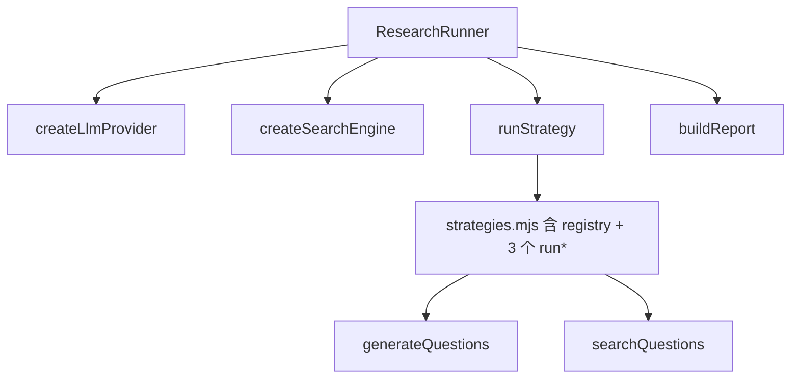
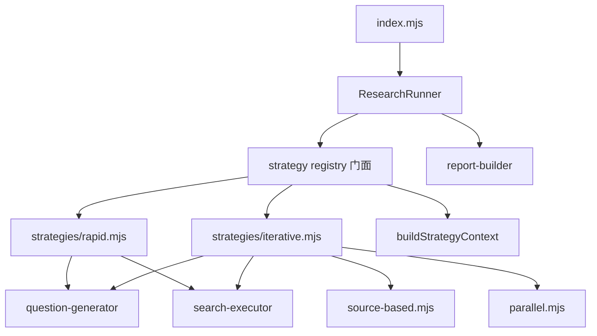

# js-deepresearch-engine 解耦：策略层拆分、上下文收窄与 registry 可重置

> 日期：2026-05-26
> 项目：js-deepresearch-agent / js-deepresearch-engine
> 类型：架构设计 / 功能实现
> 来源：Cursor Agent 对话

---

## 目录

1. [背景与动机](#1-背景与动机)
2. [分析过程](#2-分析过程)
3. [方案设计](#3-方案设计)
4. [实现要点](#4-实现要点)
5. [验证与测试](#5-验证与测试)
6. [后续演化](#6-后续演化)

---

## 1. 背景与动机

[`js-deepresearch-engine`](../../packages/js-deepresearch-engine) 已经从 agent 产品里抽离成可嵌入 runtime，但包内模块边界仍有几处「能跑，但不好长」的耦合：

- **策略 registry 与三种内置实现挤在同一文件**，`source-based` 与 `parallel` 还高度重复。
- **整包 `settings` 透传进策略**，内置逻辑直接读 `settings.research.*`，与配置 schema 绑死。
- **search 配置归一化分散**在 `mergeSettings`、`createSearchEngine`、`searxng` adapter 三处。
- **registry 是模块级全局可变状态**，测试或多次注册时容易互相污染。

真正的问题不是「有没有循环依赖」——经 import 图追踪，当前没有。真正的问题是：**随着策略和 provider 增多，这些隐性耦合会让 core 文件越来越难改**。

本轮工作分两步：先做架构与耦合性检查，再按分阶段计划落地解耦，且**不改变现有公开 API 与默认行为**。

---

## 2. 分析过程

### 2.1 主调用链（解耦前）



整体是健康的三层：**Orchestrator → Strategy Pipeline → Pluggable Adapters**。`ResearchRunner` 支持注入 mock `llm`/`search`，上层 app 通过 `registerSearchEngine('js-eyes')` 扩展搜索，说明 registry 模式本身方向正确。

### 2.2 耦合点盘点

| 位置 | 问题 | 影响 |
| ---- | ---- | ---- |
| [`strategies.mjs`](../../packages/js-deepresearch-engine/src/research/strategies.mjs) | registry + 三种 `run*` 同文件；`source-based`/`parallel` 几乎复制粘贴 | 新增策略必改 core；迭代逻辑双份维护 |
| 策略入参 | `runStrategy({ settings, ... })`，内置策略读 `settings.research.*` | 策略与 config schema 紧耦合，单测需构造完整 settings |
| search 归一化 | `defaults.mjs`、`search-factory.mjs`、`searxng.mjs` 均处理 legacy `searxngUrl` | 遗留字段逻辑分散，易出现不一致 |
| registry | `register*` 修改模块级 Map/对象；`strategyRegistry` 直接导出 | 测试隔离差；外部可 mutate |
| 类型契约 | LLM/Search 接口仅 duck-typing，未在 `types.mjs` 显式定义 | mock 与文档化成本高 |

### 2.3 被否定的方案

| 方案 | 为什么不选 |
| ---- | ---------- |
| 一次性大改公开 API（移除 `settings` 透传、停止导出 `strategyRegistry`） | 破坏宿主 app 与第三方自定义 strategy 的兼容 |
| 进度百分比完全上提到 CLI 层 | 改动面大，与本轮「结构解耦、行为不变」目标不符 |
| metadata 与 factory 彻底拆仓 | 收益偏 UI/catalog，超出本轮范围 |
| 把 `work-output` 迁出 engine 包 | 合理长期方向，但非本轮阻塞项 |

---

## 3. 方案设计

分五个阶段推进，每阶段可独立 review；阶段 1–2 优先（收益高、风险低），阶段 3–5 紧随其后。



### 关键决策

| 决策 | 选择 | 理由 |
| ---- | ---- | ---- |
| 策略文件组织 | `strategies.mjs` 只做 registry；内置实现进 `strategies/*.mjs` | 与 `registerSearchEngine('js-eyes')` 的扩展模式一致 |
| 迭代策略重复 | 抽 `iterative.mjs` 公共管线；`source-based`/`parallel` 只保留文案差异 | 消除双份循环与进度逻辑 |
| 策略上下文 | `buildStrategyContext()` 映射显式字段；内置策略不再读 `settings.research.*` | 收窄契约；自定义 strategy 仍可通过 context.settings 兼容 |
| search 归一化 | `normalizeSearchConfig` 为唯一实现；`createSearchEngine` 入口防御性归一化；adapter 只消费 `baseUrl` | 消除三处 legacy fallback |
| registry 风险 | 新增 `reset*()` / `resetEngineRegistries()`；`getStrategyRegistry()` 只读视图 | 不破坏现有 register API，改善测试隔离 |
| 公开 API | 保留 `strategyRegistry` 导出，README 标注不推荐直接 mutate | 向后兼容 |

---

## 4. 实现要点

### 4.1 策略层拆分

| 文件 | 职责 |
| ---- | ---- |
| [`src/research/strategies.mjs`](../../packages/js-deepresearch-engine/src/research/strategies.mjs) | registry 门面：`registerStrategy`、`runStrategy`、`strategyMetadata`、`resetStrategyRegistry` |
| [`src/research/strategies/rapid.mjs`](../../packages/js-deepresearch-engine/src/research/strategies/rapid.mjs) | Rapid 策略实现与 metadata |
| [`src/research/strategies/source-based.mjs`](../../packages/js-deepresearch-engine/src/research/strategies/source-based.mjs) | Source-based 薄封装 |
| [`src/research/strategies/parallel.mjs`](../../packages/js-deepresearch-engine/src/research/strategies/parallel.mjs) | Parallel 薄封装 |
| [`src/research/strategies/iterative.mjs`](../../packages/js-deepresearch-engine/src/research/strategies/iterative.mjs) | 共享迭代管线：生成问题 → 搜索 → 累积 findings → 写 `iteration` |
| [`src/research/strategy-context.mjs`](../../packages/js-deepresearch-engine/src/research/strategy-context.mjs) | `buildStrategyContext()`：从 settings 映射显式字段 |
| [`src/research/strategy-utils.mjs`](../../packages/js-deepresearch-engine/src/research/strategy-utils.mjs) | `positiveInteger`、`uniqueQuestionCount`、`resolveStrategyConcurrency` |

`runStrategy()` 在分发前统一调用 `buildStrategyContext()`，内置策略收到的 context 包含 `query`、`iterations`、`questionCount`、`concurrency`、`llm`、`search`、`signal`、`emit`，并保留 `settings` 供自定义 strategy 使用。

### 4.2 类型与 search 边界

| 文件 | 变更 |
| ---- | ---- |
| [`src/types.mjs`](../../packages/js-deepresearch-engine/src/types.mjs) | 新增 `LlmClient`、`SearchEngine`、`SearchCapabilities`、`StrategyContext`、`StrategyRunInput` typedef |
| [`src/search/search-factory.mjs`](../../packages/js-deepresearch-engine/src/search/search-factory.mjs) | `createSearchEngine()` 创建前调用 `normalizeSearchConfig()` |
| [`src/search/engines/searxng.mjs`](../../packages/js-deepresearch-engine/src/search/engines/searxng.mjs) | 移除 adapter 内 `searxngUrl` fallback，只读 `baseUrl` |

### 4.3 Registry 可重置

| 文件 | 职责 |
| ---- | ---- |
| [`src/llm/provider-factory.mjs`](../../packages/js-deepresearch-engine/src/llm/provider-factory.mjs) | `resetLlmProviders()` 恢复内置 openai-compatible / ollama |
| [`src/search/search-factory.mjs`](../../packages/js-deepresearch-engine/src/search/search-factory.mjs) | `resetSearchEngines()` 恢复内置 searxng |
| [`src/registry-reset.mjs`](../../packages/js-deepresearch-engine/src/registry-reset.mjs) | `resetEngineRegistries()` 一次重置三套 registry |

### 4.4 公开 API 增量

[`src/index.mjs`](../../packages/js-deepresearch-engine/src/index.mjs) 新增导出：

- `getStrategyRegistry`
- `resetStrategyRegistry` / `resetLlmProviders` / `resetSearchEngines` / `resetEngineRegistries`

原有 `ResearchRunner`、`registerStrategy`、`mergeSettings` 等入口**未改签名**。

### 4.5 测试护栏扩展

| 文件 | 职责 |
| ---- | ---- |
| [`tests/strategies-decoupling.test.mjs`](../../packages/js-deepresearch-engine/tests/strategies-decoupling.test.mjs) | 断言策略相关模块不 import 具体 search engine |
| [`tests/iterative-strategy.test.mjs`](../../packages/js-deepresearch-engine/tests/iterative-strategy.test.mjs) | 覆盖首轮含原 query、后续轮用 context、`iteration` 标记 |
| [`tests/registry.test.mjs`](../../packages/js-deepresearch-engine/tests/registry.test.mjs) | `afterEach` 调用 `resetEngineRegistries()`；断言 reset 后恢复内置项 |
| [`tests/normalize-search-config.test.mjs`](../../packages/js-deepresearch-engine/tests/normalize-search-config.test.mjs) | 断言 legacy `searxngUrl` 仅在归一化层处理 |

---

## 5. 验证与测试

```bash
npm run test -w js-deepresearch-engine
node --test tests/*.test.mjs
```

| 范围 | 结果 |
| ---- | ---- |
| engine 包 | **26/26** 通过 |
| 根项目（含 js-eyes 本地 provider、settings/env） | **42/42** 通过 |

行为确认点：

- `strategyMetadata` 顺序仍为 `rapid` → `source-based` → `parallel`。
- `ResearchRunner` 注入 mock、多轮 source-based、rapid 搜索问题序列与改前一致。
- app 层 `registerSearchEngine('js-eyes')` 与 `resolveSearchConcurrency` 用法不受影响。

---

## 6. 后续演化

| 方向 | 状态 | 说明 |
| ---- | ---- | ---- |
| 进度与策略解耦 | **已完成（2026-05-26 后续）** | 见下文第 7 节 |
| metadata 与 factory 分离 | 待做 | 预留 provider catalog 迁到独立模块，factory 只管 create |
| 多实例 registry | 待做 | 需要嵌入式多租户时，再引入 `createEngineRegistry()` 或 `ResearchRunner({ registries })` |
| 停止导出可变 `strategyRegistry` | 待做 | 主版本可 deprecate 后移除，强制走 `registerStrategy` / `getStrategyRegistry` |
| `work-output` 边界 | 待做 | 长期可考虑迁到 monorepo 上层，engine 包只保留纯 research runtime |

---

## 7. 收口与 progress event 解耦（同日后续）

### 7.1 做了什么

- 补充 [`README.md`](../../packages/js-deepresearch-engine/README.md) 中 registry / reset helper 的推荐用法与边界说明。
- 新增 [`progress-events.mjs`](../../packages/js-deepresearch-engine/src/research/progress-events.mjs)：
  - 内置策略上报结构化事件（`stage`、`iteration`、`completed`、`total` 等）。
  - `ResearchRunner` 通过 `createProgressEmitter()` 映射为现有 `onProgress({ message, progress, level })`。
  - 自定义 strategy 仍可使用 `emit('message', progress)` 旧式调用。
- `rapid.mjs`、`iterative.mjs` 不再硬编码最终展示文案和百分比；`source-based.mjs` / `parallel.mjs` 进一步瘦身为 variant 参数。

### 7.2 验证

| 范围 | 结果 |
| ---- | ---- |
| engine 包 | **29/29** 通过（含新增 `progress-events.test.mjs`） |
| 根项目 | **42/42** 通过 |

### 7.3 仍保留的长期路线

以下项**刻意不在本轮实现**，避免与结构解耦和 progress 解耦混在一起：

- `createEngineRegistry()` / `new ResearchRunner({ registries })`
- metadata/catalog 从 factory 分离
- `work-output` 迁出 engine 包

触发条件：出现同进程多租户、UI catalog 独立演进、或 npm 包 slim 化的明确需求时再开下一轮。

---

## 附：本轮对话问题—思考—方案—执行对照

| 阶段 | 内容 |
| ---- | ---- |
| 问题 | `js-deepresearch-engine` 模块耦合性如何？策略层、settings 透传、search 归一化、registry 全局状态是否需要治理？ |
| 思考 | 主链路分层清晰、无循环依赖；技术债集中在 `strategies.mjs` 过重、配置/schema 隐式耦合、测试隔离不足——属于「未来增长会变重」，而非已失控 |
| 方案 | 分五阶段：拆策略模块 → 抽迭代管线 → 显式 StrategyContext → 统一 search 归一化 → registry reset + 只读访问；保持公开 API 兼容 |
| 执行 | 新增 `strategies/*`、`strategy-context`、`registry-reset`；更新 types/search-factory/searxng；扩展测试；engine 26 + 根项目 42 测试全绿 |
