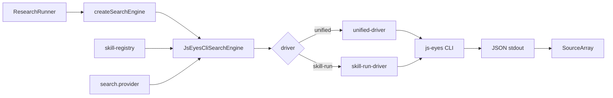

# JS Eyes 搜索解耦：从 skill 分支到统一 `items[]` 契约，再到本地 registry fallback

> 日期：2026-05-26
> 项目：js-deepresearch-agent（主要）、js-eyes（第一阶段）
> 类型：架构设计 / 功能实现
> 来源：Cursor Agent 对话

---

## 目录

1. [背景与动机](#1-背景与动机)
2. [分析过程](#2-分析过程)
3. [方案设计（第一阶段：跨仓库 unified facade）](#3-方案设计第一阶段跨仓库-unified-facade)
4. [实现要点（第一阶段）](#4-实现要点第一阶段)
5. [验证与测试（第一阶段）](#5-验证与测试第一阶段)
6. [本地解耦演化（第二阶段）](#6-本地解耦演化第二阶段)
7. [后续演化](#7-后续演化)

---

## 1. 背景与动机

第一版 JS Eyes 接入（见 [`journal/2026-05-25/js-eyes-search-provider.md`](../2026-05-25/js-eyes-search-provider.md)）解决了「能不能用浏览器 skill 搜」的问题，但 deepresearch 侧很快长出平台专属逻辑：X 需要 `navigate-search`、参数是 `--max-tweets` 而不是 `--limit`，策略层还要直接 import js-eyes 引擎来判断串行并发。

真正的问题不是「某个 skill 调不通」，而是 **deepresearch 在按 skill 写分支**——每新增一个站点，adapter 和策略层都可能要改。

目标因此分两阶段推进：

**第一阶段（跨仓库 unified facade）**

- deepresearch 只依赖稳定契约：输入 query/options，输出统一 `Source[]`。
- 平台差异（导航、参数映射、tweet/note 归一化、串行队列）下沉到 js-eyes。
- 旧 `.env` / SQLite 配置继续可用，不破坏现有用户。

**第二阶段（本地 registry fallback，同日后续）**

Reddit skill 联调暴露新问题：`js-eyes search` unified facade 对 Reddit 不兼容（`--quiet`、`--max-pages` 等参数；DOM 模式返回 0 条）。若继续在 js-eyes 侧加 profile，deepresearch 仍会被 sibling 仓库变更牵着走。

第二阶段目标调整为：

- **不再修改 js-eyes 项目**；deepresearch 仍只调外部 CLI。
- skill 参数差异由本仓库 **本地 skill registry** 管理。
- Reddit 等不兼容 skill 自动 fallback 到 `js-eyes skill run ...`；X/知乎/小红书仍走 unified facade。

---

## 2. 分析过程

### 2.1 耦合点盘点（第一阶段）

| 位置 | 问题 |
| ---- | ---- |
| [`packages/js-deepresearch-engine/src/search/engines/js-eyes.mjs`](../../packages/js-deepresearch-engine/src/search/engines/js-eyes.mjs) | 硬编码 X 参数、navigate 编排、tweet 归一化、多路径 `extractItems` |
| [`packages/js-deepresearch-engine/src/research/strategies.mjs`](../../packages/js-deepresearch-engine/src/research/strategies.mjs) | 直接 import js-eyes 模块做并发限制 |
| 配置层 | 扁平 `jsEyes*` 字段散落在 types、defaults、env |
| js-eyes skill | 各 skill stdout 结构不同（`tweets[]` / `items[]` / `notes[]`），无统一 facade |

### 2.2 第二阶段新发现（Reddit 联调）

| 现象 | 根因 |
| ---- | ---- |
| `js-eyes search --skills js-reddit-ops-skill` 返回 0 条 | unified facade 默认 DOM 模式与 Reddit skill 能力不匹配 |
| unified 拼 `--quiet`、`--max-pages`、`--timeout-ms` 报错或无效 | Reddit skill 的 argv 契约与 X/知乎/小红书不同 |
| 临时在 js-eyes 加 Reddit profile 可跑通 | 证明问题在 facade 层参数映射，而非 deepresearch 调研逻辑 |
| `.env` 默认 `JS_EYES_SKILL=js-x-ops-skill` 覆盖 CLI flag | stale `options` 覆盖显式 override（已在 normalize 层修复） |

### 2.3 被否定的方案

| 方案 | 为什么不选 |
| ---- | ---------- |
| 继续在 deepresearch adapter 里堆 X/知乎/小红书分支 | 每增 skill 改 engine，违背 Provider 抽象 |
| 继续在 js-eyes unified-search 里堆 Reddit profile | 用户明确要求不动 js-eyes；deepresearch 不应依赖 sibling 发版 |
| 一次性删掉旧 CLI（`skill run`） | 破坏现有 js-eyes 用户；Reddit 反而需要 skill-run |
| deepresearch 直接 import js-eyes protocol 包 | 重新引入 workspace/版本耦合，与「外部 CLI 产品」边界冲突 |

---

## 3. 方案设计（第一阶段：跨仓库 unified facade）

分五阶段推进，每阶段可独立回滚：


### 关键决策

| 决策 | 选择 | 理由 |
| ---- | ---- | ---- |
| 统一入口 | `js-eyes search "query" --skills ... --json` | 单一 CLI 契约，deepresearch 不再拼 skill argv |
| 统一输出 | `{ ok, items: [{ title, url, snippet, platform, ... }] }` | 新增 skill 只要输出 items，deepresearch 无需改代码 |
| 平台编排位置 | js-eyes `unified-search.js` | X navigate、串行队列、参数映射归 js-eyes 管 |
| 策略层并发 | `search.capabilities.maxQuestionConcurrency` | 消除 strategies → js-eyes 反向依赖 |
| 配置收敛 | `normalizeSearchConfig()`：legacy `jsEyes*` → `search.options` | 旧 env 可读，新结构可扩展 |
| 兼容策略 | 保留旧字段与旧 skill CLI，facade 层 attach `items[]` | 不破坏现有消费者 |

---

## 4. 实现要点（第一阶段）

### js-deepresearch-agent

| 文件 | 职责 |
| ---- | ---- |
| [`packages/js-deepresearch-engine/src/search/engines/js-eyes.mjs`](../../packages/js-deepresearch-engine/src/search/engines/js-eyes.mjs) | **薄适配器**：只调 `js-eyes search ... --json`，读 `items[]` 映射 Source；删除 X 专属分支 |
| [`packages/js-deepresearch-engine/src/search/search-capabilities.mjs`](../../packages/js-deepresearch-engine/src/search/search-capabilities.mjs) | `resolveSearchConcurrency()` 从 provider 能力读取 |
| [`packages/js-deepresearch-engine/src/search/normalize-search-config.mjs`](../../packages/js-deepresearch-engine/src/search/normalize-search-config.mjs) | legacy `jsEyes*` 合并进 `options` |
| [`packages/js-deepresearch-engine/src/research/strategies.mjs`](../../packages/js-deepresearch-engine/src/research/strategies.mjs) | 改用 `resolveSearchConcurrency`，不再 import js-eyes |
| [`packages/js-deepresearch-engine/tests/strategies-decoupling.test.mjs`](../../packages/js-deepresearch-engine/tests/strategies-decoupling.test.mjs) | 断言策略层无 js-eyes 反向依赖 |
| [`src/config/env-overrides.mjs`](../../src/config/env-overrides.mjs) | env 映射后调用 `normalizeSearchConfig` |
| [`AGENT.md`](../../AGENT.md)、[`README.md`](../../README.md)、[`.env.example`](../../.env.example) | 统一 facade 用法文档 |

薄适配器调用形态：

```bash
js-eyes search "query" --skills js-x-ops-skill --max-results 8 --max-pages 1 --server ws://localhost:18080 --json
```

### js-eyes（ sibling 仓库 `D:\github\My\js-eyes`，仅第一阶段改动）

| 文件 | 职责 |
| ---- | ---- |
| `packages/protocol/search-results.js` | tweet/note/item → 统一 `items[]`；`attachUnifiedItems()` |
| `packages/protocol/unified-search.js` | X navigate+search、串行队列、`--max-results` 映射、多 skill 合并 |
| `packages/protocol/unified-search.test.js` | 归一化与 argv 构建测试 |
| `apps/cli/src/cli.js` | 新增 `commandSearch`：`js-eyes search ...` |

统一 item 最小字段：

```json
{
  "ok": true,
  "items": [
    {
      "title": "string",
      "url": "string",
      "snippet": "string",
      "platform": "x|zhihu|xhs",
      "author": "optional",
      "publishedAt": "optional",
      "metrics": {},
      "raw": {}
    }
  ],
  "meta": {}
}
```

---

## 5. 验证与测试（第一阶段）

### 单元测试

```bash
# js-deepresearch-agent
npm test

# js-eyes
cd ../js-eyes && npm test
```

结果（2026-05-26 上午）：

| 项目 | 结果 |
| ---- | ---- |
| js-deepresearch-engine | 31/31 通过 |
| js-deepresearch-agent app tests | 17/17 通过（含 env、CLI utils） |
| js-eyes unified-search | 6/6 通过 |
| js-eyes 全量 | 通过 |

### 集成验证

统一 facade 直调：

```bash
js-eyes search "openclaw" --skills js-x-ops-skill --max-results 3 --server ws://localhost:18080 --json
```

返回 `ok: true`，3 条 `items[]`，含 `platform: "x"`、`engine: "js-eyes:x"`，原始 tweet 保留在 `raw`。

端到端调研：

```bash
npm exec jdr -- research "openclaw" --strategy rapid
```

4 轮 rapid 搜索全部成功，约 77 秒完成，产物写入 `work_dir/rapid/`。

---

## 6. 本地解耦演化（第二阶段）

### 6.1 新架构



### 6.2 关键决策

| 决策 | 选择 | 理由 |
| ---- | ---- | ---- |
| skill 差异管理位置 | deepresearch 本地 `skill-registry.mjs` | 不动 js-eyes；新增 fallback 只改本仓库 |
| 配置标准结构 | `search.provider` | 收敛 cli/driver/skills/args；legacy `jsEyes*` 映射进来 |
| normalize 层边界 | 不 import engine | 打破 normalize ↔ js-eyes 循环依赖 |
| skill 解析 | 独立 `provider-skills.mjs` | app 层不再 import `parseJsEyesSkills` |
| Driver 选择 | `auto` / `unified` / `skill-run` | Reddit 等 registry 标记 skill 自动走 skill-run |
| CLI flag 泛化 | `--search-skills` 等 + 旧 `--js-eyes-*` 兼容 | 推荐新命名，不破坏现有脚本 |

Driver 选择规则：

| 场景 | 选择 |
| ---- | ---- |
| `provider.driver === 'unified'` | 强制 `js-eyes search` |
| `provider.driver === 'skill-run'` | 全部 skill 走 `skill run` |
| `provider.driver === 'auto'` 或未配置 | 若任一 skill profile 要求 `skill-run`，走 skill-run；否则 unified |

### 6.3 本地 skill registry（初始条目）

```javascript
export const JS_EYES_SKILL_PROFILES = {
  'js-reddit-ops-skill': {
    driver: 'skill-run',
    command: 'search',
    limitFlag: '--limit',
    serverFlag: '--ws-endpoint',
    supportsMaxPages: false,
    supportsQuiet: false,
    supportsTimeoutMs: false,
    extraArgs: { 'read-mode': 'api' },
  },
};
```

Reddit 实际调用形态：

```bash
js-eyes skill run js-reddit-ops-skill search "query" \
  --limit 8 \
  --ws-endpoint ws://localhost:18080 \
  --read-mode api \
  --json
```

不拼 `--quiet`、`--max-pages`、`--timeout-ms`。

### 6.4 模块拆分

`packages/js-deepresearch-engine/src/search/engines/js-eyes/`：

| 模块 | 职责 |
| ---- | ---- |
| `constants.mjs` | 默认 timeout 等常量 |
| `provider-config.mjs` | `resolveProviderConfig()`，读 `search.provider` |
| `cli-process.mjs` | `resolveCliCommand`、`resolveSpawnTarget`、`runCommand`、timeout/abort/JSON 解析 |
| `source-normalizer.mjs` | 统一 `{ items[] }` 和 raw skill payload → `Source[]` |
| `skill-registry.mjs` | 本地 skill profile，描述 argv 能力 |
| `unified-driver.mjs` | 调 `js-eyes search "query" --skills ... --json` |
| `skill-run-driver.mjs` | 调 `js-eyes skill run <skillId> search "query" ...` |
| `merge-results.mjs` | 多 skill 结果 interleave + URL 去重 |
| `index.mjs` | `JsEyesCliSearchEngine`，按 config/profile 选择 driver |

旧路径 [`js-eyes.mjs`](../../packages/js-deepresearch-engine/src/search/engines/js-eyes.mjs) 保留为 re-export，避免大面积改 import。

配置标准形态：

```json
{
  "search": {
    "engine": "js-eyes",
    "maxResults": 8,
    "provider": {
      "cli": "js-eyes",
      "driver": "auto",
      "serverUrl": "ws://localhost:18080",
      "timeoutMs": 120000,
      "maxPages": 1,
      "skills": ["js-reddit-ops-skill"],
      "args": {}
    }
  }
}
```

兼容策略：继续读取 `jsEyesCli`、`jsEyesSkill`、`jsEyesSkills`、`jsEyesServerUrl`、`jsEyesMaxPages`、`jsEyesTimeoutMs`、`jsEyesArgs`；优先级为 **CLI / 显式顶层 override > env override > stored provider/options > defaults**。

CLI 一次性覆盖（见 [`js-eyes-cli-skill-flags.md`](./js-eyes-cli-skill-flags.md) 并扩展）：

```bash
npm exec jdr -- research "openclaw AI agent" \
  --search js-eyes \
  --search-skills js-reddit-ops-skill \
  --strategy source-based \
  --iterations 1 \
  --questions 2 \
  --concurrency 1
```

### 6.5 验证与测试（第二阶段）

```bash
npm test
```

结果（2026-05-26 下午）：

| 项目 | 结果 |
| ---- | ---- |
| js-deepresearch-engine | 35/35 通过 |
| js-deepresearch-agent app tests | 18/18 通过 |
| **合计** | **53/53 通过** |

新增 mock spawn 单测覆盖：

- unified driver 仍拼 `js-eyes search ... --skills ... --json`
- Reddit 自动走 `js-eyes skill run js-reddit-ops-skill search ... --read-mode api`
- Reddit 不拼 `--quiet`、`--max-pages`、`--timeout-ms`
- 多 skill skill-run 结果 interleave + URL 去重
- legacy `jsEyes*` 映射到 `search.provider`
- stale `options` 不覆盖显式 CLI/env override
- `--search-skills` 与 `--js-eyes-skill` 都映射到 `search.provider.skills`

集成验证（需本地 js-eyes server + Reddit skill enabled）：

```bash
js-eyes skill run js-reddit-ops-skill search "openclaw" --limit 3 --read-mode api --json

npm exec jdr -- research "openclaw AI agent" \
  --search js-eyes \
  --search-skills js-reddit-ops-skill \
  --strategy source-based \
  --iterations 1 \
  --questions 2 \
  --concurrency 1
```

Reddit source-based 联调成功：14 条来源，产物在 `work_dir/source-based/2026-05-25_162417/`。

---

## 7. 后续演化

| 方向 | 状态 | 说明 |
| ---- | ---- | ---- |
| 跨仓库 unified facade（X/知乎/小红书） | **已完成** | 第一阶段；X rapid 与 openclaw 联调通过 |
| CLI 临时 skill 选择 | **已完成** | 见 [`js-eyes-cli-skill-flags.md`](./js-eyes-cli-skill-flags.md) |
| 本地 registry + skill-run fallback | **已完成** | Reddit 不动 js-eyes 即可工作 |
| `search.provider` 配置收敛 | **已完成** | legacy `jsEyes*` 仍可读 |
| `--search-skills` 泛化 flag | **已完成** | 旧 `--js-eyes-*` / `JS_EYES_*` 兼容 |
| 各 skill runTool 内嵌 `items[]` | 部分 | 当前由 unified-search 或 deepresearch normalizer attach |
| contract 声明 `requiresSerialSearch` 等 | 待做 | 由 js-eyes 消费，减少 profile 硬编码 |
| `source-based` 多轮 + Reddit 长跑 | 待做 | 验证子问题生成、串行超时估算 |
| js-eyes 顶层 search 文档 | 待做 | 对外正式推荐 `js-eyes search` 而非 `skill run` |
| deepresearch Web UI skill 选择 | 待做 | 目前仅 env / config / CLI |
| 新增 skill fallback profile | 按需 | 在 `skill-registry.mjs` 追加条目，无需改 js-eyes |

---

## 附：两阶段问题—思考—方案—执行对照

| 阶段 | 问题 | 思考 | 方案 | 执行 |
| ---- | ---- | ---- | ---- | ---- |
| **一** | deepresearch 按 X/知乎/小红书写分支，策略层反向依赖 js-eyes | Provider 应只消费稳定契约；平台差异属于 js-eyes 产品边界 | js-eyes 提供 `search` facade + 统一 `items[]`；deepresearch 改薄 adapter + 能力抽象 | 两侧代码、测试、文档；X openclaw rapid 跑通 |
| **二** | Reddit unified facade 不兼容；改 js-eyes 成本高 | argv 差异可在 deepresearch 本地 registry 消化；仍只调 CLI | 模块拆分 + `search.provider` + skill-run fallback + 泛化 CLI flag | 53/53 测试通过；Reddit source-based 14 条来源 |
