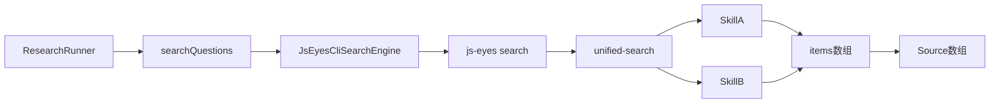

# JS Eyes 搜索解耦：从 skill 分支到统一 `items[]` 契约

> 日期：2026-05-26
> 项目：js-deepresearch-agent、js-eyes
> 类型：架构设计 / 功能实现
> 来源：Cursor Agent 对话

---

## 目录

1. [背景与动机](#1-背景与动机)
2. [分析过程](#2-分析过程)
3. [方案设计](#3-方案设计)
4. [实现要点](#4-实现要点)
5. [验证与测试](#5-验证与测试)
6. [后续演化](#6-后续演化)

---

## 1. 背景与动机

第一版 JS Eyes 接入（见 [`journal/2026-05-25/js-eyes-search-provider.md`](../2026-05-25/js-eyes-search-provider.md)）解决了「能不能用浏览器 skill 搜」的问题，但 deepresearch 侧很快长出平台专属逻辑：X 需要 `navigate-search`、参数是 `--max-tweets` 而不是 `--limit`，策略层还要直接 import js-eyes 引擎来判断串行并发。

真正的问题不是「某个 skill 调不通」，而是 **deepresearch 在按 skill 写分支**——每新增一个站点，adapter 和策略层都可能要改。

目标因此调整为：

- deepresearch 只依赖稳定契约：输入 query/options，输出统一 `Source[]`。
- 平台差异（导航、参数映射、tweet/note 归一化、串行队列）下沉到 js-eyes。
- 旧 `.env` / SQLite 配置继续可用，不破坏现有用户。

---

## 2. 分析过程

### 2.1 耦合点盘点

| 位置 | 问题 |
| ---- | ---- |
| [`packages/js-deepresearch-engine/src/search/engines/js-eyes.mjs`](../../packages/js-deepresearch-engine/src/search/engines/js-eyes.mjs) | 硬编码 X 参数、navigate 编排、tweet 归一化、多路径 `extractItems` |
| [`packages/js-deepresearch-engine/src/research/strategies.mjs`](../../packages/js-deepresearch-engine/src/research/strategies.mjs) | 直接 import js-eyes 模块做并发限制 |
| 配置层 | 扁平 `jsEyes*` 字段散落在 types、defaults、env |
| js-eyes skill | 各 skill stdout 结构不同（`tweets[]` / `items[]` / `notes[]`），无统一 facade |

### 2.2 被否定的方案

| 方案 | 为什么不选 |
| ---- | ---------- |
| 继续在 deepresearch adapter 里堆 X/知乎/小红书分支 | 每增 skill 改 engine，违背 Provider 抽象 |
| 一次性删掉旧 CLI（`skill run`） | 破坏现有 js-eyes 用户；风险高 |
| deepresearch 直接 import js-eyes protocol 包 | 重新引入 workspace/版本耦合，与「外部 CLI 产品」边界冲突 |

---

## 3. 方案设计

分五阶段推进，每阶段可独立回滚：



### 关键决策

| 决策 | 选择 | 理由 |
| ---- | ---- | ---- |
| 统一入口 | `js-eyes search "query" --skills ... --json` | 单一 CLI 契约，deepresearch 不再拼 skill  argv |
| 统一输出 | `{ ok, items: [{ title, url, snippet, platform, ... }] }` | 新增 skill 只要输出 items，deepresearch 无需改代码 |
| 平台编排位置 | js-eyes `unified-search.js` | X navigate、串行队列、参数映射归 js-eyes 管 |
| 策略层并发 | `search.capabilities.maxQuestionConcurrency` | 消除 strategies → js-eyes 反向依赖 |
| 配置收敛 | `normalizeSearchConfig()`：legacy `jsEyes*` → `search.options` | 旧 env 可读，新结构可扩展 |
| 兼容策略 | 保留旧字段与旧 skill CLI，facade 层 attach `items[]` | 不破坏现有消费者 |

---

## 4. 实现要点

### js-deepresearch-agent

| 文件 | 职责 |
| ---- | ---- |
| [`packages/js-deepresearch-engine/src/search/engines/js-eyes.mjs`](../../packages/js-deepresearch-engine/src/search/engines/js-eyes.mjs) | **薄适配器**：只调 `js-eyes search ... --json`，读 `items[]` 映射 Source；删除 X 专属分支 |
| [`packages/js-deepresearch-engine/src/search/search-capabilities.mjs`](../../packages/js-deepresearch-engine/src/search/search-capabilities.mjs) | `resolveSearchConcurrency()` 从 provider 能力读取 |
| [`packages/js-deepresearch-engine/src/search/normalize-search-config.mjs`](../../packages/js-deepresearch-engine/src/search/normalize-search-config.mjs) | legacy `jsEyes*` 合并进 `options` |
| [`packages/js-deepresearch-engine/src/research/strategies.mjs`](../../packages/js-deepresearch-engine/src/research/strategies.mjs) | 改用 `resolveSearchConcurrency`，不再 import js-eyes |
| [`packages/js-deepresearch-engine/tests/strategies-decoupling.test.mjs`](../../packages/js-deepresearch-engine/tests/strategies-decoupling.test.mjs) | 断言策略层无 js-eyes 反向依赖 |
| [`src/config/env-overrides.mjs`](../../src/config/env-overrides.mjs) | env 映射后调用 `normalizeSearchConfig` |
| [`AGENT.md`](../../AGENT.md)、[`README.md`](../../README.md)、[`.env.example`](../../.env.example) | 统一 facade 用法文档 |

薄适配器调用形态：

```bash
js-eyes search "query" --skills js-x-ops-skill --max-results 8 --max-pages 1 --server ws://localhost:18080 --json
```

### js-eyes（ sibling 仓库 `D:\github\My\js-eyes`）

| 文件 | 职责 |
| ---- | ---- |
| `packages/protocol/search-results.js` | tweet/note/item → 统一 `items[]`；`attachUnifiedItems()` |
| `packages/protocol/unified-search.js` | X navigate+search、串行队列、`--max-results` 映射、多 skill 合并 |
| `packages/protocol/unified-search.test.js` | 归一化与 argv 构建测试 |
| `apps/cli/src/cli.js` | 新增 `commandSearch`：`js-eyes search ...` |

统一 item 最小字段：

```json
{
  "ok": true,
  "items": [
    {
      "title": "string",
      "url": "string",
      "snippet": "string",
      "platform": "x|zhihu|xhs",
      "author": "optional",
      "publishedAt": "optional",
      "metrics": {},
      "raw": {}
    }
  ],
  "meta": {}
}
```

---

## 5. 验证与测试

### 单元测试

```bash
# js-deepresearch-agent
npm test

# js-eyes
cd ../js-eyes && npm test
```

结果（2026-05-26）：

| 项目 | 结果 |
| ---- | ---- |
| js-deepresearch-engine | 31/31 通过 |
| js-deepresearch-agent app tests | 17/17 通过（含 env、CLI utils） |
| js-eyes unified-search | 6/6 通过 |
| js-eyes 全量 | 通过 |

### 集成验证

统一 facade 直调：

```bash
js-eyes search "openclaw" --skills js-x-ops-skill --max-results 3 --server ws://localhost:18080 --json
```

返回 `ok: true`，3 条 `items[]`，含 `platform: "x"`、`engine: "js-eyes:x"`，原始 tweet 保留在 `raw`。

端到端调研：

```bash
npm exec jdr -- research "openclaw" --strategy rapid
```

4 轮 rapid 搜索全部成功，约 77 秒完成，产物写入 `work_dir/rapid/`。

---

## 6. 后续演化

| 方向 | 状态 | 说明 |
| ---- | ---- | ---- |
| 各 skill runTool 内嵌 `items[]` | 部分 | 当前由 unified-search 层 attach；可逐步下沉到 skill 自身 |
| contract 声明 `requiresSerialSearch` 等 | 待做 | 由 js-eyes 消费，减少 profile 硬编码 |
| `source-based` 多轮 + X 联调 | 待做 | 验证子问题为空、串行超时估算 |
| js-eyes 顶层 search 文档 | 待做 | 对外正式推荐 `js-eyes search` 而非 `skill run` |
| deepresearch Web UI skill 选择 | 待做 | 目前仅 env / config / CLI（见下一篇 journal） |

---

## 附：本轮对话问题—思考—方案—执行对照

| 阶段 | 内容 |
| ---- | ---- |
| 问题 | deepresearch 按 X/知乎/小红书写分支，策略层反向依赖 js-eyes，新增 skill 成本高 |
| 思考 | Provider 应只消费稳定契约；平台差异属于 js-eyes 产品边界；需分阶段迁移且保留兼容 |
| 方案 | js-eyes 提供 `search` facade + 统一 `items[]`；deepresearch 改薄 adapter + 能力抽象 + 配置 normalize |
| 执行 | 两侧代码、测试、文档落地；`npm test` 全通过；`openclaw` 关键词 X 搜索与 rapid 调研跑通 |
