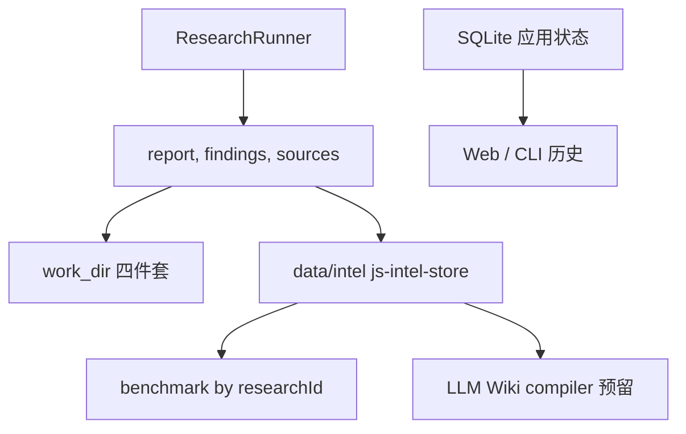

# js-intel-store 接入：研究产物的结构化归档，而不是换掉 SQLite

> 日期：2026-05-26
> 项目：js-deepresearch-agent / js-intel-store
> 类型：架构设计 / 功能实现
> 来源：Cursor Agent 对话

---

## 目录

1. [背景与动机](#1-背景与动机)
2. [分析过程](#2-分析过程)
3. [方案设计](#3-方案设计)
4. [实现要点](#4-实现要点)
5. [验证与测试](#5-验证与测试)
6. [后续演化](#6-后续演化)

---

## 1. 背景与动机

对话从两份材料展开：

1. 知乎调研产物 [`work_dir/source-based/2026-05-26_065414/report.md`](../../work_dir/source-based/2026-05-26_065414/report.md) 里总结的 **LLM Wiki** 思路（Raw / Wiki / Schema 三层，Ingest / Query / Lint 循环）。
2. 独立 npm 包 [`js-intel-store`](https://www.npmjs.com/package/js-intel-store)（轻量文件存储引擎，五种 `storageType` + `DataSourceSpec` 注册表）。

真正的问题不是「要不要上 RAG」，而是：**深度调研跑完后，产物散落在 `work_dir` 四件套和 SQLite 历史里，缺少一层可查询、可去重、可批量 benchmark 的结构化 intelligence 索引。**

当前状态：

| 存储 | 职责 | 缺口 |
| --- | --- | --- |
| `work_dir/.../report.md` 等 | 人类可读审计产物 | 按目录找，难按 `researchId` 批量读 |
| SQLite `research_history` / `sources` | Web/CLI 任务状态与历史 | 不适合 findings 明细、append-only 情报流 |
| `js-deepresearch-engine` `work-output.mjs` | 写四件套 | 无统一 catalog |

若把 LLM Wiki 的「编译层」直接塞进 engine 或替换 SQLite，风险大、边界糊。更稳妥的是：**先用 `js-intel-store` 做 artifact 归档层，保留现有路径不变。**

---

## 2. 分析过程

### 2.1 LLM Wiki 与 js-intel-store 的映射

| LLM Wiki 层 | 在本项目中的落点 |
| --- | --- |
| Raw Sources | 继续用 `work_dir` 四件套（只读锚点）；intel store 存路径与结构化副本 |
| Wiki Layer | **未在本轮实现**；预留独立 compiler |
| Schema Layer | `DataSourceSpec` catalog（`research_runs` / `findings` / `sources` / `reports`） |

`js-intel-store` 擅长：实体 JSON、按实体 JSONL 追加、去重、时区感知路径。与 research 产物（一次 run、多条 finding、多条 source）形状匹配。

### 2.2 现有完成路径

Research 完成后有两条入口都会写产物：

- Web/API：[`src/jobs/job-runner.mjs`](../../src/jobs/job-runner.mjs) → `saveResearchToWorkDir` + SQLite。
- CLI：[`src/cli-research-run.mjs`](../../src/cli-research-run.mjs) → 同上。

Benchmark 目前只认目录：[`scripts/benchmark/load-artifacts.mjs`](../../scripts/benchmark/load-artifacts.mjs) 读取 `report.md`、`findings.json`、`sources.json`、`meta.json`。

### 2.3 被否定的方案

| 方案 | 为什么不选 |
| --- | --- |
| 用 intel store 替换 SQLite | 影响 Web UI、取消、事务状态；超出本轮范围 |
| 把归档写进 `js-deepresearch-engine` | engine 应保持可嵌入 runtime，不绑定具体存储 |
| 归档失败则 research 失败 | 研究已完成，索引是附加能力，应降级 |
| 在 intel store 里复制完整 report markdown | 与 `work_dir` 重复，diff 噪音大；先存路径与长度 |

---

## 3. 方案设计

### 3.1 目标架构



### 关键决策

| 决策 | 选择 | 理由 |
| --- | --- | --- |
| 依赖来源 | npm `js-intel-store@^0.1.0` | 包已发布，不绑本地 `file:../` |
| 默认目录 | `data/intel` | 与 `data/*.sqlite` 同级；`data/` 已在 `.gitignore` |
| 覆盖目录 | 环境变量 `JDR_INTEL_STORE_DIR` | 测试隔离、多环境部署 |
| sources 去重 | `entity_jsonl` + `dedupKey: dedup_id` | 保留原始 `url` 字段；空 url 用 `title:snippet` 或 `unknown-N` |
| 归档时机 | `work_dir` 写完后再 `archiveResearchResultSafe` | 有完整 `artifacts.*Path` |
| 失败策略 | warning 日志，不抛到主流程 | 不阻断 `completed` 状态 |

### 3.2 Data sources（第一版）

| name | storageType | 键 / 语义 |
| --- | --- | --- |
| `research_runs` | `entity_json` | `name` = `researchId`，run 摘要与 artifact 路径 |
| `research_findings` | `entity_jsonl` | `_entity_id` = `researchId`，按条追加 |
| `research_sources` | `entity_jsonl` | `_entity_id` + `dedup_id` 去重 |
| `research_reports` | `entity_json` | `name` = `researchId`，report 路径与长度 |

---

## 4. 实现要点

### 4.1 依赖

[`package.json`](../../package.json)：

```json
"js-intel-store": "^0.1.0"
```

### 4.2 归档门面

[`src/storage/intel-store.mjs`](../../src/storage/intel-store.mjs) 导出：

| 函数 | 职责 |
| --- | --- |
| `createResearchIntelRegistry()` | 注册四个 data source |
| `createIntelStoreEngine()` / `getIntelStoreEngine()` | 引擎单例（可 `resetIntelStoreEngine()` 测） |
| `archiveResearchResult()` | 写入 run / findings / sources / report meta |
| `archiveResearchResultSafe()` | 捕获异常 + `onWarning` |
| `readArchivedResearch()` / `loadArtifactsByResearchId()` | 按 `researchId` 读回 benchmark 形状 |

磁盘布局（示意）：

```text
data/intel/
├── research_runs/
│   └── <safe-research-id>.json
├── research_findings/
│   └── <research-id>.jsonl
├── research_sources/
│   └── <research-id>.jsonl
└── research_reports/
    └── <safe-research-id>.json
```

### 4.3 完成路径接入

[`src/jobs/job-runner.mjs`](../../src/jobs/job-runner.mjs)：`saveResearchToWorkDir` 返回 `artifacts` 后调用 `archiveResearchResultSafe`，失败写入 job log（`level: warn`）。

[`src/cli-research-run.mjs`](../../src/cli-research-run.mjs)：有 `recordId` 时在更新 SQLite `completed` 前归档；非 JSON 模式打印 warning。

### 4.4 Benchmark 双入口

[`scripts/benchmark/load-artifacts.mjs`](../../scripts/benchmark/load-artifacts.mjs)：

- `loadArtifacts(workDir)` — 不变。
- `loadArtifactsByResearchId(researchId)` — 从 intel store 加载。

[`scripts/benchmark/run-benchmark.mjs`](../../scripts/benchmark/run-benchmark.mjs) 支持 `researchId` 与可选 `engine`（测试用）。

### 4.5 未实现（按计划延后）

- LLM Wiki compiler（`scripts/wiki/compile.mjs` 等）
- `research_events` 日志流
- SQLite 迁移

---

## 5. 验证与测试

```bash
npm test
```

结果：engine 包 + app 层 **73/73** 通过（含本轮新增与扩展）。

| 测试文件 | 覆盖点 |
| --- | --- |
| [`tests/intel-store-archive.test.mjs`](../../tests/intel-store-archive.test.mjs) | 归档、去重、`sourceDedupId`、safe 降级、缺 `researchId` |
| [`tests/benchmark-research.test.mjs`](../../tests/benchmark-research.test.mjs) | `loadArtifactsByResearchId` + `runBenchmark({ researchId })` |
| [`tests/cli-research-cancel.test.mjs`](../../tests/cli-research-cancel.test.mjs) | 完成路径归档；`JDR_INTEL_STORE_DIR` 隔离 |

按 `researchId` 读产物示例：

```javascript
import { loadArtifactsByResearchId } from './src/storage/intel-store.mjs';

const artifacts = loadArtifactsByResearchId('<uuid>');
```

```javascript
import { runBenchmark } from './scripts/benchmark/run-benchmark.mjs';

await runBenchmark({ researchId: '<uuid>', llmEnabled: false });
```

---

## 6. 后续演化

| 方向 | 说明 |
| --- | --- |
| LLM Wiki compiler | 从 intel store 读 runs/findings/sources，输出 `wiki/` + lint 报告，回链 raw |
| Benchmark CLI | `benchmark-research.mjs` 增加 `--research-id` 参数 |
| 历史回填 | 对已有 `work_dir` 目录写一次性 import 脚本 |
| `research_events` | 将 `research_logs` 同步为 append-only 情报流（可选） |
| 发布协同 | `js-intel-store` 升级时对齐 API（当前 `^0.1.0`） |

---

## 附：本轮对话问题—思考—方案—执行对照

| 阶段 | 内容 |
| --- | --- |
| 问题 | 研究产物分散在 `work_dir` 与 SQLite，难以按 `researchId` 索引、批量 benchmark，也难承接 LLM Wiki 式知识编译 |
| 思考 | intel store 适合做 artifact 层，不是 app DB；engine 保持轻量；归档失败不应拖垮 research |
| 方案 | 四 data source + app 层门面；双写 work_dir + `data/intel`；benchmark 双入口；Wiki compiler 延后 |
| 执行 | 接入 `js-intel-store@^0.1.0`，实现 `intel-store.mjs`，改 job-runner / cli-research-run / benchmark loader，补测试并切 npm 依赖 |
