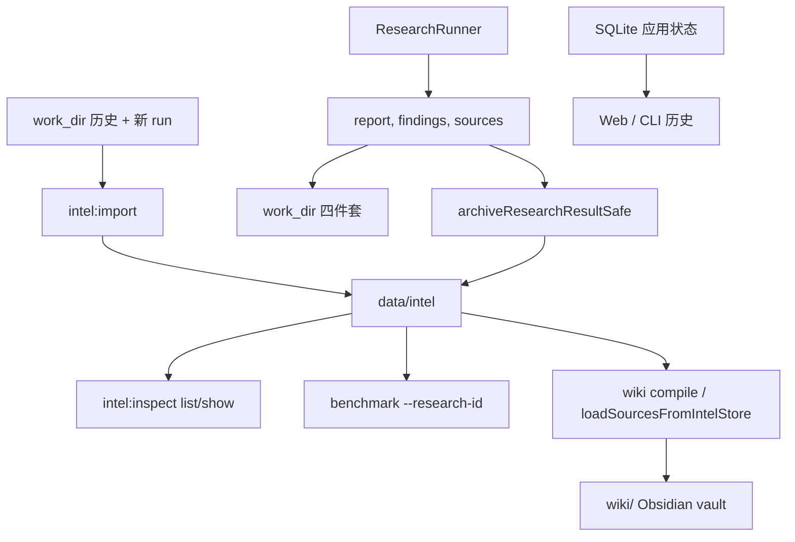

# js-intel-store 接入：从归档层到可操作的 intelligence 索引

> 日期：2026-05-26
> 项目：js-deepresearch-agent / js-intel-store
> 类型：架构设计 / 功能实现
> 来源：Cursor Agent 对话

---

## 目录

1. [背景与动机](#1-背景与动机)
2. [分析过程](#2-分析过程)
3. [方案设计](#3-方案设计)
4. [实现要点](#4-实现要点)
5. [验证与测试](#5-验证与测试)
6. [后续演化](#6-后续演化)

---

## 1. 背景与动机

对话从两份材料展开：

1. 知乎调研产物 [`work_dir/source-based/2026-05-26_065414/report.md`](../../work_dir/source-based/2026-05-26_065414/report.md) 里总结的 **LLM Wiki** 思路（Raw / Wiki / Schema 三层，Ingest / Query / Lint 循环）。
2. 独立 npm 包 [`js-intel-store`](https://www.npmjs.com/package/js-intel-store)（轻量文件存储引擎，五种 `storageType` + `DataSourceSpec` 注册表）。

真正的问题不是「要不要上 RAG」，而是：**深度调研跑完后，产物散落在 `work_dir` 四件套和 SQLite 历史里，缺少一层可查询、可去重、可批量 benchmark 的结构化 intelligence 索引。**

第一轮只解决了「新 research 写完能归档」；历史 `work_dir` 仍进不了索引，人也很难确认 `data/intel` 里到底有什么。第二轮把归档层推进到**可回填、可查看、可按 `researchId` 评估**。第三轮（同日晚间）把 intel 从「索引 + 本机路径指针」升级为**可搬迁、可独立 compile Wiki 的自包含包**：内联 report、schema v2、source 元数据、旧归档 upgrade 路径。

| 存储 | 职责 | 缺口（各轮后） |
| --- | --- | --- |
| `work_dir/.../report.md` 等 | 人类可读审计产物 | v1：历史 run 未自动进入 intel；v2 起 report 仍保留作 raw 锚点 |
| SQLite `research_history` / `sources` | Web/CLI 任务状态与历史 | 不适合 findings 明细 |
| `data/intel` | 结构化 catalog | v1：缺 CLI；v2：缺内联 report，Wiki 依赖路径；**v3：自包含单包** |

若把 LLM Wiki 的「编译层」直接塞进 engine 或替换 SQLite，风险大、边界糊。更稳妥的是：**先用 `js-intel-store` 做 artifact 归档层，保留现有路径不变。**

---

## 2. 分析过程

### 2.1 LLM Wiki 与 js-intel-store 的映射

| LLM Wiki 层 | 在本项目中的落点 |
| --- | --- |
| Raw Sources | 继续用 `work_dir` 四件套（只读锚点）；intel store 存路径 + 结构化副本 + **v3 内联 report** |
| Wiki Layer | 已实现；见 [`js-wiki-engine.md`](./js-wiki-engine.md)；**v3 起可仅依赖 `data/intel` 编译** |
| Schema Layer | `DataSourceSpec` catalog（`research_runs` / `findings` / `sources` / `reports`）；**v3：`archiveSchemaVersion: 2`** |

### 2.2 现有完成路径

Research 完成后有两条入口都会写产物并归档：

- Web/API：[`src/jobs/job-runner.mjs`](../../src/jobs/job-runner.mjs) → `saveResearchToWorkDir` + `archiveResearchResultSafe` + SQLite。
- CLI：[`src/cli-research-run.mjs`](../../src/cli-research-run.mjs) → 同上。

Benchmark 支持两种读法：

- 目录：[`scripts/benchmark/load-artifacts.mjs`](../../scripts/benchmark/load-artifacts.mjs) → `loadArtifacts(workDir)`。
- researchId：同文件 `loadArtifactsByResearchId()` + CLI [`--research-id`](../../scripts/benchmark-research.mjs)。

### 2.3 被否定的方案

| 方案 | 为什么不选 |
| --- | --- |
| 用 intel store 替换 SQLite | 影响 Web UI、取消、事务状态 |
| 把归档写进 `js-deepresearch-engine` | engine 应保持可嵌入 runtime |
| 归档失败则 research 失败 | 索引是附加能力，应降级 |
| 导入 ID 使用 `imported:strategy:timestamp` | Windows 文件名不允许 `:`，会导致 `entity_json` 写入失败 |
| 扫描 `work_dir` 下所有子目录 | 会把 `data/intel` 等误当 strategy；改为只认 `YYYY-MM-DD_HHMMSS` session 目录 |

---

## 3. 方案设计

### 3.1 目标架构



### 关键决策

| 决策 | 选择 | 理由 |
| --- | --- | --- |
| 依赖来源 | npm `js-intel-store@^0.1.0` | 包已发布，不绑本地 `file:../` |
| 默认目录 | `data/intel` | 与 `data/*.sqlite` 同级；`data/` 已在 `.gitignore` |
| 覆盖目录 | `JDR_INTEL_STORE_DIR` | 测试隔离、多环境 |
| 历史导入 ID | `imported__<strategy>__<timestamp>` | 稳定、可重复 skip；Windows 安全 |
| 有 meta.researchId | 直接用 UUID | 与 SQLite / Web 历史一致 |
| 重复导入 | 默认 skip 已存在 run | 避免 findings JSONL 重复追加 |
| 旧归档升级 | `--upgrade-existing` | 从 `work_dir` 重归档已有 run，补内联 report 与 v2 元数据 |
| 强制重导 | `--force` | 跳过 skip，重归档全部 session（含已有 run） |
| Benchmark CLI | `<work-dir>` 与 `--research-id` 互斥 | 不破坏旧脚本与人工路径习惯 |
| 可搬迁性 | `research_reports.report` 内联正文 | 只复制 `data/intel` 即可 `wiki compile`，不硬依赖 `work_dir` |

### 3.2 Data sources（schema v2）

| name | storageType | 键 / 语义 | v3 新增或变更 |
| --- | --- | --- | --- |
| `research_runs` | `entity_json` | `name` = `researchId` | `archiveSchemaVersion: 2` |
| `research_findings` | `entity_jsonl` | `_entity_id` = `researchId` | 不变；含完整 `raw` |
| `research_sources` | `entity_jsonl` | `dedup_id` 去重 | `sourceIndex`、`fetchStatus`、`hasContent`、`contentLength`、`archivedAt` |
| `research_reports` | `entity_json` | report 元数据 | **`report` 内联 Markdown 正文**；仍保留 `reportPath` 作溯源 |

读取优先级（`readArchivedResearch` / Wiki adapter）：

1. `research_reports.report`（内联）
2. `reportPath` 文件（旧归档 fallback）
3. 空字符串

---

## 4. 实现要点

### 4.1 归档门面

[`src/storage/intel-store.mjs`](../../src/storage/intel-store.mjs)：

| 导出 | 职责 |
| --- | --- |
| `ARCHIVE_SCHEMA_VERSION` | 当前为 `2` |
| `archiveResearchResult` | 写入四 datasource；report 内联 + source 元数据 |
| `archiveResearchResultSafe` | 失败不阻断 research |
| `readArchivedResearch` / `loadArtifactsByResearchId` | 优先读内联 report |
| `sourceDedupId` | URL 优先；无 URL 时用 `sha256(title:snippet:content)` |

### 4.2 历史回填与旧归档升级

| 文件 | 职责 |
| --- | --- |
| [`scripts/intel/import-work-dir-core.mjs`](../../scripts/intel/import-work-dir-core.mjs) | `discoverWorkDirSessions`、`importWorkDirSessions`、稳定 ID |
| [`scripts/intel/import-work-dir.mjs`](../../scripts/intel/import-work-dir.mjs) | CLI：`--root`、`--strategy`、`--dry-run`、`--force`、`--upgrade-existing`、`--json` |

逻辑要点：

- 复用 `loadArtifacts(workDir)` 解析四件套。
- Session 目录必须匹配 `^\d{4}-\d{2}-\d{2}_\d{6}$`。
- `resolveResearchId()`：`meta.researchId` 优先，否则 `imported__<strategy>__<timestamp>`。
- **`upgradeExisting`**：对已存在于 intel 的 run 从 `work_dir` 重调 `archiveResearchResult()`，补 v2 字段；未归档 session 仍会首次 import。
- 导入摘要区分 **`Imported`** / **`Upgraded`** 计数。

```bash
# 首次回填
npm run intel:import -- --dry-run --strategy source-based
npm run intel:import -- --strategy source-based

# 旧 v1 归档升级（需本地仍有 work_dir 四件套）
npm exec jdr -- intel import --upgrade-existing
npm exec jdr -- intel import --upgrade-existing --dry-run

# 强制全部重归档
npm exec jdr -- intel import --force
```

### 4.3 Inspect / List

| 文件 | 职责 |
| --- | --- |
| [`scripts/intel/inspect-core.mjs`](../../scripts/intel/inspect-core.mjs) | `listArchivedRuns`、`showArchivedRun`、`listArchivedSources`、`listArchivedFindings` |
| [`scripts/intel/inspect.mjs`](../../scripts/intel/inspect.mjs) | CLI：`list` / `show` / `sources` / `findings`，支持 `--json`、`--limit` |

```bash
npm run intel:inspect -- list
npm exec jdr -- intel list --limit 10
npm run intel:inspect -- show 00176e84-2548-4160-add1-7df5a49f7e27
npm run intel:inspect -- sources imported__source-based__2026-05-26_052953 --limit 5
```

### 4.4 Wiki 消费路径（v3）

[`packages/js-wiki-engine/src/source-adapters/intel-store.mjs`](../../packages/js-wiki-engine/src/source-adapters/intel-store.mjs) 的 `loadSourcesFromIntelStore()`：

- report：内联 → 文件路径 → 空。
- sources：按 `sourceIndex` 排序；透传 `fetchStatus` / `hasContent` 等至 `normalizeWikiSource()`。
- `sessionDir` 不存在时不阻断 compile。

```bash
# 仅 data/intel 即可编译（work_dir 可不存在）
npm exec jdr -- wiki compile --research-id 00176e84-2548-4160-add1-7df5a49f7e27 --vault wiki --lint
```

### 4.5 Benchmark CLI

| 文件 | 职责 |
| --- | --- |
| [`scripts/benchmark/resolve-target.mjs`](../../scripts/benchmark/resolve-target.mjs) | `resolveBenchmarkTarget`（可单测，避免 import CLI 副作用） |
| [`scripts/benchmark-research.mjs`](../../scripts/benchmark-research.mjs) | 支持 `--research-id`；CLI 入口用 `import.meta.url` guard |
| [`scripts/benchmark/run-benchmark.mjs`](../../scripts/benchmark/run-benchmark.mjs) | `researchId` + 可选 `engine` |

```bash
# 目录（原方式）
node scripts/benchmark-research.mjs work_dir/source-based/2026-05-26_043125 --no-llm

# researchId（回填或新 run 归档后）
node scripts/benchmark-research.mjs --research-id 00176e84-2548-4160-add1-7df5a49f7e27 --no-llm
```

### 4.6 npm scripts

[`package.json`](../../package.json)：

```json
"intel:import": "node scripts/intel/import-work-dir.mjs",
"intel:inspect": "node scripts/intel/inspect.mjs"
```

### 4.7 实现中踩过的坑

| 现象 | 根因 | 修复 |
| --- | --- | --- |
| 导入后 `imported` 计数为 0 | Windows 下 `imported:...` 含 `:`，无法写 `research_runs/*.json` | ID 改为 `imported__...` |
| 扫描到 `intel/research_runs` 当 strategy | import 的 `root` 与 `data/intel` 同级时误扫子目录 | Session 目录名正则过滤 |
| `npm run intel:import` 末尾报错 | `main()` 非 async 却 `.catch()` | 改为 `try/catch` |
| 测试 import `benchmark-research.mjs` 失败 | 顶层直接执行 `main()` | 抽出 `resolve-target.mjs` + CLI guard |
| v1 归档 Wiki 依赖 `reportPath` | `research_reports` 无内联正文 | v3 写入 `report` 字段；adapter 内联优先 |
| 无 URL source 去重碰撞 | `title:snippet` 易重复 | `sourceDedupId` 改用 content hash |
| upgrade 后 source 元数据未变 | `js-intel-store` 对相同 `dedup_id` 可能不覆盖旧 JSONL 行 | run/report 已升级；source 元数据对新 run 生效；**待完善 force 清源重导** |

---

## 5. 验证与测试

### 单元 / 集成测试

```bash
npm test
```

结果：**93/93** 通过。

| 测试文件 | 覆盖点 |
| --- | --- |
| [`tests/intel-store-archive.test.mjs`](../../tests/intel-store-archive.test.mjs) | 归档、去重、safe 降级、**内联 report、schema v2** |
| [`tests/intel-store-import.test.mjs`](../../tests/intel-store-import.test.mjs) | dry-run、导入、skip、`--upgrade-existing`、稳定 ID |
| [`tests/intel-store-inspect.test.mjs`](../../tests/intel-store-inspect.test.mjs) | list / show / sources / findings |
| [`tests/benchmark-research.test.mjs`](../../tests/benchmark-research.test.mjs) | `researchId` benchmark + `resolveBenchmarkTarget` |
| [`tests/wiki-compile.test.mjs`](../../tests/wiki-compile.test.mjs) | **删除 work_dir 后仅靠 intel compile** |
| [`packages/js-wiki-engine/tests/intel-store-adapter.test.mjs`](../../packages/js-wiki-engine/tests/intel-store-adapter.test.mjs) | 内联 report 优先、`sourceIndex` 排序 |

### 真实 work_dir 端到端（2026-05-26）

| 步骤 | 命令 | 结果 |
| --- | --- | --- |
| dry-run | `npm run intel:import -- --dry-run --strategy source-based` | 发现 10 个 session |
| import | `npm run intel:import -- --strategy source-based` | 10/10 导入 `data/intel` |
| list | `npm run intel:inspect -- list` | 列出全部归档 run |
| benchmark | `--research-id 00176e84-2548-4160-add1-7df5a49f7e27 --no-llm` | LLM wiki 报告：20 claims，引用率 90% |
| **upgrade** | `npm exec jdr -- intel import --upgrade-existing` | 扫描 49；**Upgraded 31**、Imported 18、Failed 0 |
| **verify** | `readArchivedResearch('00176e84-...')` | `archiveSchemaVersion: 2`，内联 report 5632 字符 |

**researchId 取值说明：**

- 有 `meta.researchId` 的 session（如 `2026-05-26_065414`）→ 用 UUID。
- 无 `researchId` 的旧目录 → 用 `imported__source-based__2026-05-26_052953` 等形式。

---

## 6. 后续演化

| 方向 | 状态 | 说明 |
| --- | --- | --- |
| 历史回填 | 已完成 | `npm run intel:import` / `jdr intel import` |
| Benchmark `--research-id` | 已完成 | CLI + `runBenchmark` |
| Inspect / list | 已完成 | `npm run intel:inspect` / `jdr intel list` |
| LLM Wiki compiler | 已完成 | 见 [`js-wiki-engine.md`](./js-wiki-engine.md) |
| **可搬迁自包含归档（schema v2）** | **已完成** | 内联 report、source 元数据、`--upgrade-existing` |
| **`--no-work-dir` 仍可 compile** | **已完成** | report + sources 进 intel |
| `research_events` | 待做 | 可选：同步 `research_logs` |
| SQLite 迁移 | 不做 | 短期仍分工明确 |
| upgrade 时 source JSONL 全量覆盖 | 待完善 | 相同 `dedup_id` 可能保留 v1 行；需清源或 store 层 upsert |
| `--force` 重导 findings | 待完善 | 当前 force 重归档 run；findings 可能追加重复 |

---

## 附：问题—思考—方案—执行对照

| 阶段 | 第一轮（接入） | 第二轮（落地） | 第三轮（可搬迁） |
| --- | --- | --- | --- |
| 问题 | 产物分散，难按 researchId 索引 | 归档层「写得进」但历史与工具链不可用 | Wiki 仍依赖 `work_dir` 路径；旧归档非自包含 |
| 思考 | artifact 层，不替 SQLite | 先 import + inspect + benchmark CLI | 内联 report + v2 元数据；intel 单包 compile |
| 方案 | 四 data source + 双写 work_dir/intel | 回填脚本、稳定 ID、session 正则 | `archiveSchemaVersion: 2`、`--upgrade-existing`、adapter 内联优先 |
| 执行 | `intel-store.mjs`、job-runner、CLI 归档 | `import-work-dir`、`inspect`、`--research-id` | 93 测通过；本机 upgrade 31 条已有 run |
