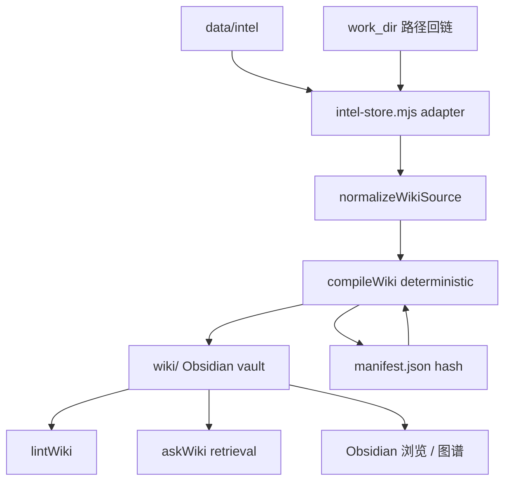

# js-wiki-engine：把 intel store 编译成可在 Obsidian 里直接用的 LLM Wiki

> 日期：2026-05-26
> 项目：js-deepresearch-agent / js-wiki-engine
> 类型：架构设计 / 功能实现
> 来源：Cursor Agent 对话

---

## 目录

1. [背景与动机](#1-背景与动机)
2. [分析过程](#2-分析过程)
3. [方案设计](#3-方案设计)
4. [实现要点](#4-实现要点)
5. [验证与测试](#5-验证与测试)
6. [后续演化](#6-后续演化)

---

## 1. 背景与动机

`js-intel-store` 接入并落地之后，`data/intel` 已经能按 `researchId` 索引 runs、sources、findings 和 report 路径。但真正要「用起来」，还差 Karpathy **LLM Wiki** 里那一层：**把 raw research 编译成人类可浏览、可点链接、可看图谱的 Wiki**。

对话里的材料很清晰：

- 调研报告 [`work_dir/source-based/2026-05-26_065414/report.md`](../../work_dir/source-based/2026-05-26_065414/report.md) 总结了 Raw / Wiki / Schema 三层，以及 Ingest / Query / Lint 循环。
- 前一篇日记 [`js-intel-store-integration.md`](./js-intel-store-integration.md) 把 **Raw + Schema（catalog）** 落在 intel store；**Wiki 编译层** 当时标为「待做」。

真正的问题不是「再做一个 Markdown 导出脚本」，而是：

> **不用任何 engine，打开 vault 也要能在 Obsidian 里读、搜、点 wikilink、看图谱。**

这意味着输出必须是 Obsidian 兼容 vault（Wikilink、YAML frontmatter、Windows-safe 文件名），而不是仅供程序消费的中间格式。同时 raw / `work_dir` 只读，增量编译靠 `manifest.json`，第一版不绑 LLM 稳定性。

---

## 2. 分析过程

### 2.1 三层职责怎么切

| 层 | 落点 | 本轮是否实现 |
| --- | --- | --- |
| Raw Sources | `work_dir` 四件套 + intel store 结构化副本 | 只读输入，不修改 |
| Wiki Layer | `packages/js-wiki-engine` → `wiki/` vault | **MVP 完成** |
| Schema / Catalog | `js-intel-store` data sources | 已有，adapter 读取 |

### 2.2 输入从哪来

编译器不假设输入一定来自 deepresearch runtime，而是先 **normalize** 成统一 source record，再确定性生成页面。生产路径首选：

`data/intel` → `loadSourcesFromIntelStore({ engine, researchId })` → `compileWiki()`。

### 2.3 被否定的方案

| 方案 | 为什么不选 |
| --- | --- |
| 在 `js-deepresearch-engine` 里直接写 Wiki | engine 应保持可嵌入，Wiki 是独立编译 concern |
| research 完成自动 compile | MVP 范围外；避免拖慢 research 路径 |
| 向量 RAG / 复杂检索 | 计划明确不做；`askWiki` 先做确定性检索 |
| 默认写入 `.obsidian/` | 避免覆盖用户配置；仅 `initObsidianConfig: true` 时写最小 `app.json` |
| 把 `manifest.json` 当人类入口 | 只给 engine 做增量；Home / MOC 才是入口 |

---

## 3. 方案设计

### 3.1 数据流



### 3.2 Vault 结构（默认 `wiki/`）

```text
wiki/
├── Home.md
├── Map of Content.md
├── Sources/<researchId>/Source NNN - <title>.md
├── Topics/<Query Title>.md
├── Claims/<Topic> Claims.md
├── Questions/
├── Lint/latest.md
├── Templates/{Topic,Source,Claim}.md
└── manifest.json
```

### 关键决策

| 决策 | 选择 | 理由 |
| --- | --- | --- |
| 包形态 | workspace `packages/js-wiki-engine` | 可独立测试、可被其他宿主引用 |
| 编译模式 | `mode: 'deterministic'`，`llm = null` 可跑 | 第一版不依赖 LLM 稳定性 |
| 增量 | source `sha256` hash + manifest 跳过未变页 | 53 条 source 二次编译可 0 写入 |
| 内链 | `wikilinkPath()` 去掉 `.md` | Obsidian 笔记名约定 |
| 文件名 | `safeObsidianFilename()` 过滤非法字符 | Windows + Obsidian 双兼容 |
| 宿主脚本 | `scripts/wiki/compile.mjs` 不进包内核 | 读 `data/intel` 是 app 职责 |
| Lint 范围 | 跳过 `Lint/`、`Templates/` 的 wikilink 扫描 | 避免报告正文误报 |
| 源正文里的 `[[...]]` | `escapeLiteralWikilinks()` 包进反引号 | 教程示例不应变成断链 |

### 3.3 Public API（第一版）

```javascript
initWiki({ vaultDir, initObsidianConfig = false })
compileWiki({ vaultDir, sources, report, meta, llm = null, mode = 'deterministic', force = false })
lintWiki({ vaultDir })
askWiki({ vaultDir, question, llm = null })  // async，有 llm 时调 complete/chat
normalizeWikiSource(input)
loadSourcesFromIntelStore({ engine, researchId })
```

---

## 4. 实现要点

### 4.1 包结构

```text
packages/js-wiki-engine/
├── src/
│   ├── index.mjs / wiki-engine.mjs   # 导出门面
│   ├── vault.mjs                     # initWiki、目录、Templates、Home/MOC
│   ├── obsidian.mjs                  # safeObsidianFilename、wikilink、titleCaseQuery
│   ├── yaml.mjs / markdown.mjs       # frontmatter、renderPage、claim 抽取、转义 wikilink
│   ├── schema.mjs                    # normalizeWikiSource、hashSource、分组
│   ├── manifest.mjs                  # 增量 manifest 读写
│   ├── ingest.mjs                    # compileWiki 主编排
│   ├── lint.mjs                      # lintWiki + Lint/latest.md
│   ├── query.mjs                     # askWiki 检索 / LLM 占位
│   ├── prompts.mjs                   # 后续 LLM 模式 prompt 模板
│   └── source-adapters/intel-store.mjs
└── tests/                            # vault / markdown / compile / lint / adapter
```

### 4.2 关键模块

| 文件 | 职责 |
| --- | --- |
| [`packages/js-wiki-engine/src/ingest.mjs`](../../packages/js-wiki-engine/src/ingest.mjs) | Source / Topic / Claims / Home / MOC 生成；manifest 记录 |
| [`packages/js-wiki-engine/src/source-adapters/intel-store.mjs`](../../packages/js-wiki-engine/src/source-adapters/intel-store.mjs) | 从 `StorageEngine` 读 run、sources、report |
| [`packages/js-wiki-engine/src/lint.mjs`](../../packages/js-wiki-engine/src/lint.mjs) | 断链、manifest 缺页、topic sources；多行 YAML frontmatter 解析 |
| [`packages/js-wiki-engine/src/query.mjs`](../../packages/js-wiki-engine/src/query.mjs) | 无 LLM：按词频打分返回相关页；有 LLM：拼 prompt |
| [`scripts/wiki/compile.mjs`](../../scripts/wiki/compile.mjs) | CLI：`--research-id`、`--vault`、`--force`、`--lint`、`--json` |

### 4.3 宿主接入

[`package.json`](../../package.json)：

```json
"js-wiki-engine": "workspace:*",
"wiki:compile": "node scripts/wiki/compile.mjs"
```

测试链路包含 wiki workspace：

```bash
npm run test -w js-wiki-engine
npm test
```

常用编译命令：

```bash
npm run wiki:compile -- --research-id 00176e84-2548-4160-add1-7df5a49f7e27 --vault wiki --lint
```

### 4.4 实现中踩过的坑

| 现象 | 根因 | 修复 |
| --- | --- | --- |
| Lint 报 `[[页面名称]]` 断链 | 源文章 snippet 含 Obsidian 教程示例 wikilink | 编译时 `escapeLiteralWikilinks`；lint 忽略反引号内链接 |
| Lint 在 `Lint/latest.md` 里自我报错 | 报告消息里写了 `[[target]]` 又被扫描 | 跳过 `Lint/`；消息改为纯文本 target |
| `topic_no_sources` 误报 | lint 只解析单行 frontmatter | 支持 `sources:\n  - id` 多行列表 |
| adapter 测试 `writeSource is not a function` | intel store API 是 `ingest` | 测试改用 `engine.ingest` |

---

## 5. 验证与测试

### 单元 / 集成测试

```bash
npm run test -w js-wiki-engine   # 13/13
npm test                         # 81/81（含 tests/wiki-compile.test.mjs）
```

| 测试文件 | 覆盖点 |
| --- | --- |
| [`packages/js-wiki-engine/tests/compile.test.mjs`](../../packages/js-wiki-engine/tests/compile.test.mjs) | 页面生成、manifest、增量 skip、hash 变更重编 |
| [`packages/js-wiki-engine/tests/lint.test.mjs`](../../packages/js-wiki-engine/tests/lint.test.mjs) | 断链、manifest 缺页 |
| [`packages/js-wiki-engine/tests/intel-store-adapter.test.mjs`](../../packages/js-wiki-engine/tests/intel-store-adapter.test.mjs) | adapter 读归档数据 |
| [`tests/wiki-compile.test.mjs`](../../tests/wiki-compile.test.mjs) | 宿主：archive → compile → lint |

### 真实 researchId 端到端（2026-05-26）

| 步骤 | 命令 | 结果 |
| --- | --- | --- |
| 全量编译 | `wiki:compile --research-id 00176e84-... --vault wiki --force` | 53 pages written，Topic: Llm Wiki |
| 增量编译 | 同上（无 `--force`） | **53 skipped**，0 written |
| Lint | `--lint` | **0 errors**，0 warns |

产物目录：[`wiki/`](../../wiki/)（可用 Obsidian 直接打开）。

---

## 6. 后续演化

| 方向 | 状态 | 说明 |
| --- | --- | --- |
| 确定性 compile MVP | 已完成 | source / topic stub / claims / MOC / manifest |
| intel-store adapter + `wiki:compile` | 已完成 | 从 `data/intel` 一键出 vault |
| 基础 lint / ask | 已完成 | lint 结构化报告；ask 检索 MVP |
| LLM 合并 topic、矛盾标注 | 待做 | `compileWiki({ llm, mode })` 已预留抛错 |
| Query 答案写入 `Questions/` | 待做 | 与 askWiki LLM 模式联动 |
| research 完成自动 compile | 不做（短期） | 保持 research 路径轻量 |
| `wiki/` 是否 gitignore | 待产品决定 | 生成物较大，可按团队习惯处理 |

---

## 附：问题—思考—方案—执行对照

| 阶段 | 内容 |
| --- | --- |
| 问题 | intel store 能索引 research，但缺少 Obsidian 可用的 Wiki 编译层 |
| 思考 | Raw 只读；Wiki 独立包；MVP 确定性可跑；manifest 增量降 diff 噪音 |
| 方案 | `js-wiki-engine` workspace + vault 结构 + intel adapter + 宿主 `wiki:compile` |
| 执行 | 包内 13 测 + 宿主 wiki-compile；真实 run 53 source 编译与 lint 0 错 |
