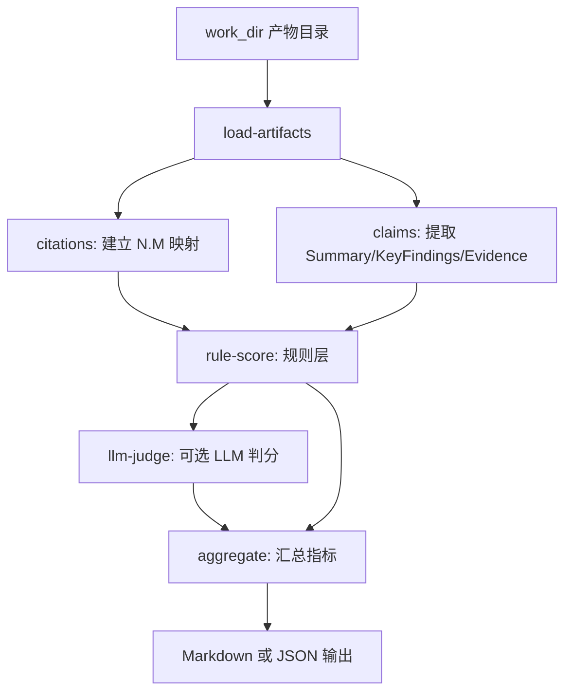

# 来源匹配 Benchmark：从知乎调研静默失败到离线判分脚本

> 日期：2026-05-26
> 项目：js-deepresearch-agent
> 类型：问题排查 / 功能实现
> 来源：Cursor Agent 对话

---

## 目录

1. [背景与动机](#1-背景与动机)
2. [分析过程](#2-分析过程)
3. [方案设计](#3-方案设计)
4. [实现要点](#4-实现要点)
5. [验证与测试](#5-验证与测试)
6. [后续演化](#6-后续演化)

---

## 1. 背景与动机

本轮对话里先后出现三个相关诉求：

1. **验证当前 LLM 配置是否可用**（DeepSeek API）。
2. **在知乎上对 `llm wiki` 做深度调研**（`source-based` + `js-zhihu-ops-skill`）。
3. **新增 benchmark 脚本**，离线评估报告结论与引用来源是否匹配。

真正的问题不在「能不能跑完 research」，而在 **「跑完以后，报告是否可信」**。

第一次知乎调研虽然 CLI 显示 `Research complete`，产物目录也写入了完整报告，但 `findings.json` 里 7 次搜索全部失败（`未知命令: search`），`sources.json` 为空。报告内容实际来自 LLM 内置知识，写的是通用「大语言模型百科」，而不是知乎上讨论的 Karpathy **LLM Wiki** 方案。

这说明当前系统缺少一层 **来源—结论一致性检查**。benchmark 脚本正是为弥补这一缺口而设计。

---

## 2. 分析过程

### 2.1 LLM 连通性

通过 `SettingsStore` 读取 SQLite + `.env` 合并后的配置，调用 `createLlmProvider` 发起一次最小 completion。当前配置：

| 项 | 值 |
| --- | --- |
| Provider | `openai-compatible` |
| Model | `deepseek-v4-flash` |
| Base URL | `https://api.deepseek.com` |

约 2.3 秒返回 `LLM test OK`，LLM 层无阻塞。

### 2.2 知乎搜索为何第一次全失败

[`src/search-providers/js-eyes/skill-registry.mjs`](../../src/search-providers/js-eyes/skill-registry.mjs) 中：

- `js-x-ops-skill`、`js-reddit-ops-skill` 已注册为 `driver: 'skill-run'`，走 `js-eyes skill run <skill> search ...`。
- `js-zhihu-ops-skill` 仍使用默认 `driver: 'unified'`，调用 `js-eyes search ... --skills ...`。

本机 `js-eyes` 2.8.2 **不支持** unified 的 `search` 子命令，但 skill-run 可用：

```bash
js-eyes skill run js-zhihu-ops-skill search "llm wiki" --limit 3 --ws-endpoint ws://localhost:18080 --json
```

手动验证返回 3 条知乎结果；deep research 管线却走了 unified 路径，7 次搜索均报错，错误被写入 `findings[].error`，**报告合成阶段仍继续**，造成「看似成功、实则无来源」的静默失败。

### 2.3 第二次调研成功

将 `js-zhihu-ops-skill` 加入 skill-run profile（`--ws-endpoint`、`--limit`、`--quiet`）后重跑，约 59 秒完成。产物目录 `work_dir/source-based/2026-05-26_043125` 中 `sources.json` 含真实知乎链接，报告聚焦 Karpathy LLM Wiki 与个人知识库实践。

### 2.4 Benchmark 设计约束

报告引用格式由 [`packages/js-deepresearch-engine/src/research/prompts.mjs`](../../packages/js-deepresearch-engine/src/research/prompts.mjs) 约定为 `[N.M]`，对应 `findings[N-1].sources[M-1]`。产物四件套由 [`work-output.mjs`](../../packages/js-deepresearch-engine/src/research/work-output.mjs) 固定写出，适合作为离线评估输入。

Benchmark **不**重新执行 research 或搜索，**不**抓取 URL 全文；第一版仅基于已保存的 title/snippet 判定。

---

## 3. 方案设计

### 3.1 知乎 skill 修复

| 决策 | 选择 | 理由 |
| --- | --- | --- |
| 知乎驱动 | `skill-run` | 与 X、Reddit 一致；本机 js-eyes 无 unified `search` |
| server 参数 | `--ws-endpoint` | 与手动验证及 Reddit profile 一致 |
| 改动范围 | 仅 `skill-registry.mjs` + 对应测试 | 最小 diff，不碰 engine 包 |

### 3.2 Benchmark 架构



| 决策 | 选择 | 理由 |
| --- | --- | --- |
| 输入 | 单次 work session 目录 | 可复现、可对比修复前后 |
| 评分层 | 规则层 + 可选 LLM 层 | CI 用 `--no-llm`；本地可用 LLM 语义判分 |
| Claim 范围 | Summary / Key Findings / Evidence | 与报告 prompt 结构对齐 |
| 平台校验 | `--strict-platform js-eyes:zhihu` | 防止「声称知乎来源、实际 engine 不符」 |
| 非目标 | 不 rerun research、不抓全文 | 控制范围，避免 benchmark 本身变成二次调研 |

### 3.3 被否定的方案

| 方案 | 为什么不选 |
| --- | --- |
| Benchmark 内重新跑 js-eyes 搜索 | 与「离线评估已保存产物」目标冲突；结果不可稳定复现 |
| 仅 LLM 判分、无规则层 | 无法低成本发现空 sources、引用不存在等结构性问题 |
| 修改 report 生成逻辑强制校验 | 超出本轮范围；benchmark 先做观测，再考虑生成期拦截 |

---

## 4. 实现要点

### 4.1 知乎 skill-run 修复

| 文件 | 变更 |
| --- | --- |
| [`src/search-providers/js-eyes/skill-registry.mjs`](../../src/search-providers/js-eyes/skill-registry.mjs) | 新增 `js-zhihu-ops-skill` profile：`driver: 'skill-run'` |
| [`tests/js-eyes-local-provider.test.mjs`](../../tests/js-eyes-local-provider.test.mjs) | 知乎用例从 unified facade 改为 skill-run 断言 |

### 4.2 Benchmark 脚本

```
scripts/
├── benchmark-research.mjs          # CLI 入口
└── benchmark/
    ├── load-artifacts.mjs          # 读取 report/findings/sources/meta
    ├── citations.mjs               # [N.M] 映射与解析
    ├── claims.mjs                  # 从 report.md 提取 claim
    ├── rule-score.mjs              # 引用、字段、平台、关键词规则
    ├── llm-judge.mjs               # 可选 LLM JSON 判分
    ├── aggregate.mjs               # 汇总指标与 riskExamples
    ├── format-output.mjs           # Markdown / JSON 输出
    └── run-benchmark.mjs           # 主流程编排
```

| 模块 | 职责 |
| --- | --- |
| `load-artifacts` | 校验四文件存在并解析 JSON/Markdown |
| `citations` | `findings[i].sources[j]` → `[i+1.j+1]` |
| `claims` | 按 `## Summary` / `## Key Findings` / `## Evidence` 切段 |
| `rule-score` | 无引用、引用未解析、来源字段缺失、平台不匹配、低关键词重合 |
| `llm-judge` | `supported / partially_supported / unsupported / unverifiable` |
| `aggregate` | `claimCount`、各 rate 指标、最多 10 条 riskExamples |

CLI 复用 [`src/config/bootstrap-env.mjs`](../../src/config/bootstrap-env.mjs) 与 `SettingsStore` 读取 LLM 配置；`package.json` 增加 `"benchmark": "node scripts/benchmark-research.mjs"`。

### 4.3 文档

- [`README.md`](../../README.md) — Benchmark 用法与产物说明
- [`AGENT.md`](../../AGENT.md) — Agent 侧 benchmark 命令与 flag 表

---

## 5. 验证与测试

### 5.1 LLM

```bash
node --input-type=module -e "..."  # createLlmProvider + complete
```

结果：约 2.3s，响应 `LLM test OK`。

### 5.2 知乎 skill-run

```bash
js-eyes skill run js-zhihu-ops-skill search "llm wiki" --limit 3 --ws-endpoint ws://localhost:18080 --json
node --input-type=module -e "..."  # JsEyesCliSearchEngine.search via skill-run
```

均返回 3 条知乎结果，`engine: js-eyes:zhihu`。

### 5.3 深度调研

```bash
npm exec jdr -- research "llm wiki" --search js-eyes --search-skills js-zhihu-ops-skill --strategy source-based
```

| 轮次 | 产物 | sources | 报告主题 |
| --- | --- | --- | --- |
| 第一次（修复前） | `2026-05-26_042948` | 空 | 通用 LLM 百科（LLM 幻觉） |
| 第二次（修复后） | `2026-05-26_043125` | 多条知乎 URL | Karpathy LLM Wiki |

### 5.4 Benchmark

```bash
npm run benchmark -- work_dir/source-based/2026-05-26_043125 --no-llm
npm test
```

`--no-llm` 样例输出（修复后产物）：

- `claimCount`: 13
- `claimsWithCitationsRate`: 62%
- `citationResolutionRate`: 100%
- `sourcePresenceRate`: 100%
- Summary 与部分无引用子 bullet 被标为 `no_citation` 风险

单元测试 [`tests/benchmark-research.test.mjs`](../../tests/benchmark-research.test.mjs)：8 用例，覆盖 citation 映射、claim 提取、空来源、平台不匹配、`--no-llm`。全量 `npm test` 55 pass。

---

## 6. 后续演化

| 方向 | 说明 |
| --- | --- |
| 生成期拦截 | `sources` 为空或全部 `findings.error` 时，report 合成前告警或降级 |
| 批量 benchmark | 扫描 `work_dir/*/*`，对比多次调研指标趋势 |
| 全文抓取 | 可选拉取 URL 正文，提高 LLM 判分准确度（成本与隐私需评估） |
| 其他 skill | 小红书等若也不支持 unified `search`，按知乎模式补 skill-run profile |
| Summary 引用策略 | 当前 Summary 常无 citation，可在 report prompt 中要求或 benchmark 单独加权 |

---

## 附：本轮对话问题—思考—方案—执行对照

| 阶段 | 内容 |
| --- | --- |
| 问题 | LLM 是否可用？知乎深度调研 `llm wiki` 是否可信？如何系统化评估报告与来源匹配？ |
| 思考 | 第一次调研「成功」但 sources 为空，根因是知乎走 unified 而本机 js-eyes 无 `search` 命令；缺少离线判分手段 |
| 方案 | 知乎改 skill-run；新增只读 benchmark（规则层 + 可选 LLM），读 work_dir 四件套 |
| 执行 | 修复 `skill-registry.mjs`；重跑调研得真实知乎报告；落地 `scripts/benchmark/` 与测试、文档；全量测试通过 |
