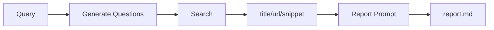
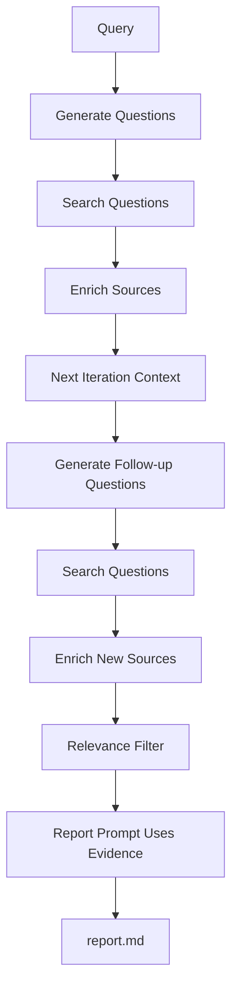

# Source-Based 深度阅读：从 snippet 合成到 URL 正文 enrichment

> 日期：2026-05-26
> 项目：js-deepresearch-agent / js-deepresearch-engine
> 类型：架构设计 / 功能实现
> 来源：Cursor Agent 对话

---

## 目录

1. [背景与动机](#1-背景与动机)
2. [分析过程](#2-分析过程)
3. [方案设计](#3-方案设计)
4. [实现要点](#4-实现要点)
5. [验证与测试](#5-验证与测试)
6. [后续演化](#6-后续演化)

---

## 1. 背景与动机

知乎 `llm wiki` 调研在修复 skill-run 后已经能产出 56 条真实来源（见 [`research-source-benchmark.md`](./research-source-benchmark.md)），但 benchmark 仍暴露一个结构性问题：**报告写得很像「读过正文」，证据层却只有 title 级 snippet**。

真正的问题不是「搜索有没有结果」，而是 **source-based 策略在搜索与报告合成之间缺少「读 URL」这一步**。

当前 `source-based` 只是对共享 [`iterative.mjs`](../../packages/js-deepresearch-engine/src/research/strategies/iterative.mjs) 的薄封装：每轮生成问题 → 搜索 → 把 `title/url/snippet` 交给 [`reportPrompt`](../../packages/js-deepresearch-engine/src/research/prompts.mjs) 写报告。LLM 很容易用内置知识补全细节，benchmark 里 `low_keyword_overlap`、`no_citation` 就是这一 gap 的量化表现。

对比 [local-deep-research (LDR)](https://github.com/LearningCircuit/local-deep-research)，后者在搜索后会抓取正文、过滤来源、多轮 LLM 合成。本轮目标是在 **不改动 `parallel` / `rapid`** 的前提下，只升级 `source-based` 的数据流。

---

## 2. 分析过程

### 2.1 现有 source-based 数据流



`parallel` 与 `source-based` 此前共用同一条迭代链；follow-up context 由 [`formatSourcesForQuestionContext`](../../packages/js-deepresearch-engine/src/research/question-generator.mjs) 格式化，**只输出 Snippet 字段**。

### 2.2 关键约束

| 约束 | 含义 |
| --- | --- |
| 默认行为不变 | 升级后用户不配置时应与旧版成本、行为一致 |
| 只改 source-based | `parallel` 继续 `runIterativeStrategy()`，避免牵连 broad 策略 |
| 失败可回退 | 知乎等页面可能反爬、需登录、JS 渲染；抓取失败不能拖垮整次 research |
| 成本可控 | `summary` 模式每 URL 多一次 LLM 调用，必须显式开启 |
| 产物兼容 | `Source` 新字段全部可选，旧 `snippet` 保留 |

### 2.3 与 benchmark 的关系

[`scripts/benchmark/rule-score.mjs`](../../scripts/benchmark/rule-score.mjs) 第一版只用 `title + snippet` 算关键词重合。深度阅读落地后，规则层同步改为 **`summary || content || snippet`**，以便 enriched 产物能被正确判分。

---

## 3. 方案设计

### 3.1 目标数据流



### 3.2 关键决策

| 决策 | 选择 | 理由 |
| --- | --- | --- |
| Pipeline 拆分 | 新建 `source-based-pipeline.mjs` | 与 `parallel` 解耦；迭代逻辑不再双份维护 |
| 默认 fetch 模式 | `disabled` | 无网络、反爬、LLM 成本均不突变 |
| 抓取实现 | Node 内置 `fetch` + 轻量 HTML 清洗 | 不引入 heavy dependency |
| Enrichment 模式 | `full` / `summary` | `full` 写 `content`；`summary` 再调 LLM 压缩 |
| 相关性过滤 | 默认关闭，可选 LLM 分批评分 | 非 JSON 响应降级为规则保留，不中断调研 |
| Evidence 优先级 | `summary \|\| content \|\| snippet` | 报告与 follow-up context 统一证据语义 |
| CLI 覆盖 | 4 个 `--source-*` flags | 单次运行试验，不写 SQLite |

### 3.3 被否定的方案

| 方案 | 为什么不选 |
| --- | --- |
| 改共享 `iterative.mjs` 加 enrichment | 会影响 `parallel` 行为与成本 |
| 默认开启 `summary` | LLM 调用与抓取失败面过大 |
| LangGraph / subagent 按章节二次调研 | 超出本轮范围 |
| 向量索引 / 知识库 | 非当前产品形态 |
| enrichment 失败则中止 research | 与「snippet 回退」原则冲突 |

### 3.4 默认配置

`research.sourceBased`（[`defaults.mjs`](../../packages/js-deepresearch-engine/src/config/defaults.mjs)）：

| 键 | 默认 | 说明 |
| --- | --- | --- |
| `fetchMode` | `disabled` | `full` / `summary` 需显式开启 |
| `maxUrlsPerIteration` | 8 | 每轮 enrich 上限 |
| `maxUrlsTotal` | 24 | 全局 URL cap |
| `maxContentChars` | 8000 | 正文截断 |
| `enrichConcurrency` | 2 | 并发抓取 |
| `enableRelevanceFilter` | `false` | LLM 相关性过滤 |
| `maxSourcesForReport` | 30 | 过滤后保留数 |
| `questionContextLimit` | 30 | follow-up context 条数 |
| `contextCharsPerSource` | 500 | 单条 evidence 截断 |

---

## 4. 实现要点

### 4.1 模块结构

```
packages/js-deepresearch-engine/src/research/
├── strategies/
│   ├── source-based.mjs           # 入口，调用 pipeline
│   ├── source-based-pipeline.mjs  # 独立迭代 + enrich + filter
│   ├── iterative.mjs              # parallel 仍用此文件，未改行为
│   └── parallel.mjs
├── source-based-settings.mjs      # 配置解析、getSourceEvidence()
├── content-fetcher.mjs            # HTTP fetch + HTML 清洗
├── source-enricher.mjs            # disabled/full/summary、去重、cap
├── source-context.mjs             # follow-up context formatter
├── source-relevance-filter.mjs    # 可选 LLM 过滤 + 非 JSON 降级
├── prompts.mjs                    # report 用 enriched evidence
└── progress-events.mjs            # enriching_sources / filtering_sources 阶段
```

### 4.2 关键模块职责

| 文件 | 职责 |
| --- | --- |
| [`source-based-pipeline.mjs`](../../packages/js-deepresearch-engine/src/research/strategies/source-based-pipeline.mjs) | 迭代搜索 → 可选 enrich → 可选 filter → 返回 findings |
| [`source-enricher.mjs`](../../packages/js-deepresearch-engine/src/research/source-enricher.mjs) | URL 去重、全局 cap、失败写 `fetchStatus: failed` |
| [`content-fetcher.mjs`](../../packages/js-deepresearch-engine/src/research/content-fetcher.mjs) | `fetch` + strip script/style/tag，超时 15s |
| [`source-context.mjs`](../../packages/js-deepresearch-engine/src/research/source-context.mjs) | 第二轮 question prompt 用 enriched evidence |
| [`source-relevance-filter.mjs`](../../packages/js-deepresearch-engine/src/research/source-relevance-filter.mjs) | 分批 LLM 评分，保留 top N，写回 `relevanceScore` |
| [`types.mjs`](../../packages/js-deepresearch-engine/src/types.mjs) | `Source.content/summary/fetchStatus/...`、`SourceBasedSettings` |
| [`src/cli-utils.mjs`](../../src/cli-utils.mjs) | `--source-fetch-mode` 等 CLI 映射 |

### 4.3 Source 扩展字段（均可选）

| 字段 | 含义 |
| --- | --- |
| `content` | `full` 模式抓取的正文 |
| `summary` | `summary` 模式 LLM 压缩摘要 |
| `fetchStatus` | `skipped` / `ok` / `failed` |
| `fetchError` | 失败原因 |
| `relevanceScore` / `relevanceKeep` / `relevanceReason` | 过滤阶段评分 |

### 4.4 CLI 用法

```bash
npm exec jdr -- research "llm wiki" \
  --search js-eyes \
  --search-skills js-zhihu-ops-skill \
  --strategy source-based \
  --source-fetch-mode summary \
  --source-max-urls 12 \
  --source-enable-filter true \
  --source-max-sources 30
```

文档已同步至 [`README.md`](../../README.md)、[`AGENT.md`](../../AGENT.md)。

---

## 5. 验证与测试

### 5.1 单元测试

新增 [`packages/js-deepresearch-engine/tests/source-based-reading.test.mjs`](../../packages/js-deepresearch-engine/tests/source-based-reading.test.mjs)，覆盖：

| 场景 | 断言 |
| --- | --- |
| `fetchMode: disabled` | 与旧迭代行为等价 |
| enricher | 成功、失败回退、去重、cap、`summary` 模式 |
| relevance filter | 非 JSON 降级、LLM 过滤、评分写回 sources |
| report prompt | 优先 `summary/content`，system 约束勿幻觉 |
| parallel 隔离 | `sourceBased` 配置不触发 enrich/filter 阶段 |
| progress events | `enriching_sources` / `filtering_sources` 映射 |

```bash
npm test
```

结果：**57 pass**（engine 50 + app 层 7 新增/扩展用例）。

### 5.2 Benchmark

规则层已支持 enriched evidence：

```bash
npm run benchmark -- work_dir/source-based/2026-05-26_043125 --no-llm --strict-platform js-eyes:zhihu
```

说明：`2026-05-26_043125` 是 **改造前** 产物，sources 仅有 snippet，benchmark 可跑通但 `low_keyword_overlap` 仍会偏高。**开启 enrichment 后需重跑调研** 才能验证指标改善。

### 5.3 尚未现场验证的风险

| 风险 | 说明 |
| --- | --- |
| 知乎正文抓取 | 可能因登录、反爬、JS 渲染失败；设计上回退 snippet |
| `summary` 成本 | 每 URL +1 LLM 调用，24 URL 上限仍可能显著增时延 |
| 过滤 LLM 稳定性 | 已实现非 JSON 降级，但极端情况下可能保留噪声来源 |

---

## 6. 后续演化

| 方向 | 说明 |
| --- | --- |
| 重跑知乎 benchmark | 用 `--source-fetch-mode summary` 生成新 session，对比 `low_keyword_overlap` |
| 生成期拦截 | sources 为空或全部 failed 时在 report 合成前告警（见 benchmark journal 建议） |
| 浏览器抓取 | 知乎等 SPA 可考虑 js-eyes 已登录浏览器上下文，而非裸 HTTP fetch |
| per-domain fetch 策略 | 知乎 / Reddit / 普通 HTML 分 profile |
| 批量 benchmark | 扫描 `work_dir`，对比 disabled vs summary 指标趋势 |

---

## 附：本轮对话问题—思考—方案—执行对照

| 阶段 | 内容 |
| --- | --- |
| 问题 | source-based 只基于 snippet 写报告，证据薄、benchmark 关键词重合低；如何像 LDR 一样「读来源」又不牵连 parallel/rapid？ |
| 思考 | 应在搜索与报告之间插入 enrich + 可选 filter；默认 disabled 保兼容；失败回退 snippet；证据语义统一为 summary/content/snippet |
| 方案 | 独立 `source-based-pipeline`；`content-fetcher` + `source-enricher` + `source-relevance-filter`；扩展配置/types/CLI；report 与 context 用 enriched evidence |
| 执行 | 落地 6 个新模块 + pipeline 改造；57 测试通过；benchmark 规则层支持 enriched evidence；README/AGENT 补文档；旧 work_dir benchmark 可离线复跑 |
