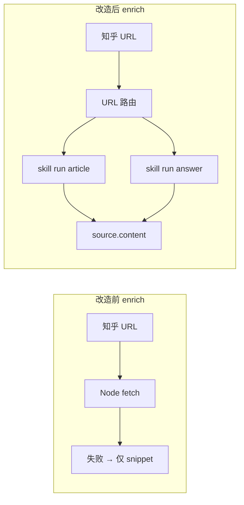
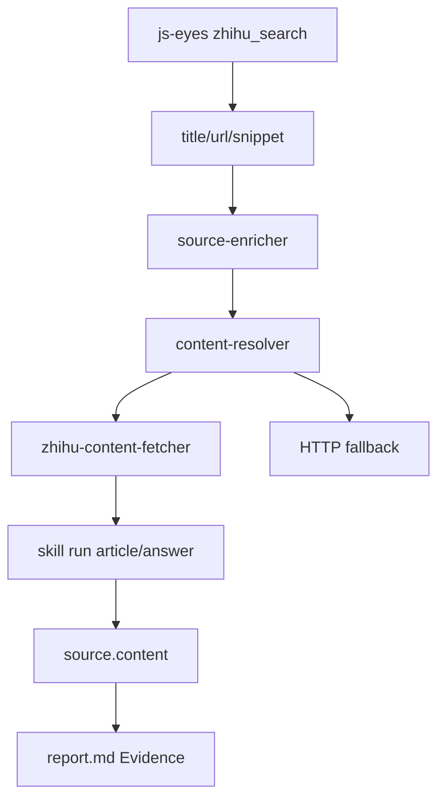

# 知乎 Source Enrichment：用 js-eyes 浏览器读正文，而不是 HTTP 抓 snippet

> 日期：2026-05-26
> 项目：js-deepresearch-agent / js-deepresearch-engine
> 类型：功能实现 / 问题排查
> 来源：Cursor Agent 对话

---

## 目录

1. [背景与动机](#1-背景与动机)
2. [分析过程](#2-分析过程)
3. [方案设计](#3-方案设计)
4. [实现要点](#4-实现要点)
5. [验证与测试](#5-验证与测试)
6. [后续演化](#6-后续演化)

---

## 1. 背景与动机

[`source-based-deep-reading.md`](./source-based-deep-reading.md) 已为 `source-based` 策略补上 URL enrichment 管线，但第一版正文抓取走 Node 内置 `fetch` + HTML 清洗。

对知乎来说，这条路几乎走不通：登录墙、JS 渲染、反爬都会让 HTTP 直接失败，enrichment 只能回退到 title 级 snippet——报告依然「看起来像读过正文」，benchmark 里 `low_keyword_overlap` 下不来。

真正的问题不是「有没有 enrichment 开关」，而是 **知乎正文该由谁读**。

本机已启用 [`js-zhihu-ops-skill`](d:\github\My\js-eyes\skills\js-zhihu-ops-skill)（v3.0，浏览器 DOM 读取）。搜索阶段早已通过 `skill run ... search` 拿到真实 URL；缺的是 enrich 阶段按 URL 调 `article` / `answer` 子命令，把 `result.content` 写进 `findings.json`。

---

## 2. 分析过程

### 2.1 js-zhihu-ops-skill 已有能力

| Skill 工具 / CLI | 适用 URL | 返回字段 |
| --- | --- | --- |
| `zhihu_get_article` / `article <url>` | `zhuanlan.zhihu.com/p/{id}` | `result.content` |
| `zhihu_get_answer` / `answer <url>` | `zhihu.com/question/{q}/answer/{a}` | `result.content` |
| `zhihu_search` / `search` | — | 已在 research 搜索阶段使用 |

Bridge 从 DOM 抽取 `RichText`，失败时返回 `login_required`、`captcha_required`、`dom_not_found` 等——与「失败写 `fetchStatus: failed`、保留 snippet」的设计一致。

手动验证命令：

```bash
js-eyes skill run js-zhihu-ops-skill article \
  "https://zhuanlan.zhihu.com/p/2026793291014842204" \
  --ws-endpoint ws://localhost:18080 --json --quiet
```

### 2.2 与 HTTP enrichment 的差距



[`work_dir/source-based/2026-05-26_043125`](../../work_dir/source-based/2026-05-26_043125) 有 56 条知乎来源，但 sources 无 `content` 字段；[`2026-05-26_052953`](../../work_dir/source-based/2026-05-26_052953) 跑通后 6/8 带来正文。

### 2.3 架构约束

| 约束 | 含义 |
| --- | --- |
| engine 不依赖 js-eyes | `js-eyes` 是 app-local provider，handler 在 app 层注册 |
| 默认兼容 | `fetchMode: disabled` 不变；`fetchBackend: auto` 默认 |
| 失败可回退 | 单条 enrich 失败不拖垮整次 research |
| 串行与风控 | 浏览器读取宜保守；js-eyes 搜索已是 concurrency 1 |

---

## 3. 方案设计

### 3.1 目标数据流



### 3.2 关键决策

| 决策 | 选择 | 理由 |
| --- | --- | --- |
| 抽象层 | engine `content-resolver` + handler registry | 不把 js-eyes 写进 npm 包 |
| 知乎 handler | app `zhihu-content-fetcher.mjs` | 复用现有 CLI 进程与 provider 配置 |
| URL 路由 | 专栏 → `article`；回答 → `answer` | 与 skill CLI 子命令一一对应 |
| `fetchBackend` | `auto` / `http` / `js-eyes` | `auto` 先 handler 再 HTTP；`js-eyes` 不回退 HTTP |
| 注册时机 | `register-local-search-engines.mjs` | 与 js-eyes 搜索 provider 同生命周期 |

### 3.3 被否定的方案

| 方案 | 为什么不选 |
| --- | --- |
| 继续优化 HTTP User-Agent 抓知乎 | 根因是登录 + JS，不是 HTTP 头 |
| 在 engine 内硬编码 js-eyes | 破坏 engine/app 解耦 |
| enrich 时再调 `zhihu_search` 猜正文 | 已有直链，应直接 `article`/`answer` |

---

## 4. 实现要点

### 4.1 Engine：可插拔 resolver

| 文件 | 职责 |
| --- | --- |
| [`content-resolver.mjs`](../../packages/js-deepresearch-engine/src/research/content-resolver.mjs) | `registerContentFetchHandler` / `resolveUrlContent` / HTTP 回退 |
| [`source-enricher.mjs`](../../packages/js-deepresearch-engine/src/research/source-enricher.mjs) | 改调 resolver，传入 `settings` |
| [`source-based-settings.mjs`](../../packages/js-deepresearch-engine/src/research/source-based-settings.mjs) | 新增 `fetchBackend` |
| [`registry-reset.mjs`](../../packages/js-deepresearch-engine/src/registry-reset.mjs) | 测试隔离时 reset handlers |

### 4.2 App：知乎 handler

| 文件 | 职责 |
| --- | --- |
| [`zhihu-content-fetcher.mjs`](../../src/search-providers/js-eyes/zhihu-content-fetcher.mjs) | URL 分类、构造 `skill run` 命令、解析 payload |
| [`register-local-search-engines.mjs`](../../src/search-providers/register-local-search-engines.mjs) | 启动时 `registerContentFetchHandler(...)` |

典型命令构造：

```text
js-eyes skill run js-zhihu-ops-skill article <url> \
  --ws-endpoint ws://localhost:18080 \
  --timeout-ms 90000 --json --quiet
```

### 4.3 CLI 与配置

```bash
npm exec jdr -- research "llm wiki" \
  --search js-eyes \
  --search-skills js-zhihu-ops-skill \
  --search-server-url ws://localhost:18080 \
  --strategy source-based \
  --source-fetch-mode full \
  --source-fetch-backend js-eyes \
  --source-max-urls 4
```

| 配置 / Flag | 默认 | 说明 |
| --- | --- | --- |
| `research.sourceBased.fetchBackend` | `auto` | 知乎走 handler，其余可 HTTP |
| `--source-fetch-backend` | — | `auto` \| `http` \| `js-eyes` |

---

## 5. 验证与测试

### 5.1 单元测试

```bash
npm test
```

结果：**65 pass**（含 content resolver、知乎 URL 路由、skill-run 命令构造、handler 注册等用例）。

### 5.2 本机 js-eyes 前置

```bash
js-eyes doctor --json
```

`js-zhihu-ops-skill` 已 enabled；egress 含 `zhihu.com` / `zhuanlan.zhihu.com`。

### 5.3 端到端调研（知乎 + full + js-eyes）

```bash
npm exec jdr -- research "llm wiki" \
  --search js-eyes \
  --search-skills js-zhihu-ops-skill \
  --search-server-url ws://localhost:18080 \
  --strategy source-based \
  --iterations 1 \
  --questions 1 \
  --source-fetch-mode full \
  --source-fetch-backend js-eyes \
  --source-max-urls 2 \
  --no-save
```

| 项 | 结果 |
| --- | --- |
| 产物目录 | [`work_dir/source-based/2026-05-26_052953`](../../work_dir/source-based/2026-05-26_052953) |
| 耗时 | 约 85 秒 |
| 来源数 | 8 |
| `fetchStatus: ok` | **6** |
| `fetchStatus: failed` | 2（保留 snippet，未中断） |
| 报告主题 | Karpathy LLM Wiki（编译器 vs 解释器、三层架构、Obsidian 实践等） |

与改造前 [`2026-05-26_043125`](../../work_dir/source-based/2026-05-26_043125) 对比：新产物 sources 含数千字 `content`，报告 Evidence 段可引用 [1.2]–[1.8] 等带正文支撑的结论。

### 5.4 Benchmark 与已知限制

```bash
npm run benchmark -- work_dir/source-based/2026-05-26_052953 --no-llm --strict-platform js-eyes:zhihu
```

当前 benchmark **claim 提取只认英文段落标题**（`## Summary` 等），而 LLM 报告用了中文 `## 摘要`，导致 `claimCount: 0`——这是 benchmark 解析缺口，**不代表 enrichment 未生效**。规则层 keyword overlap 已支持 `summary || content || snippet`（见 [`rule-score.mjs`](../../scripts/benchmark/rule-score.mjs)）。

另：首次加 `--json` 曾因 LLM API 瞬时错误报 `fetch failed`；去掉 `--json` 重跑成功。

---

## 6. 后续演化

| 方向 | 说明 |
| --- | --- |
| Benchmark 中文报告 | `claims.mjs` 支持 `## 摘要` / `## 关键发现` 等中文标题 |
| 对比 benchmark | 同一 query 跑 `043125`（无 content）vs `052953`（有 content）量化 `low_keyword_overlap` 变化 |
| `summary` 模式 | 在已有正文上 LLM 压缩，进一步控 token |
| 纯问题页 | `zhihu.com/question/{id}` 仅摘要列表，第一版不 deep-read |
| 其他平台 handler | Reddit / X 等按同样 registry 模式扩展 |

---

## 附：本轮对话问题—思考—方案—执行对照

| 阶段 | 内容 |
| --- | --- |
| 问题 | HTTP enrichment 对知乎无效；如何用 js-zhihu-ops-skill 的浏览器读取能力补正文？ |
| 思考 | 搜索与 enrich 应共用 js-eyes；engine 只做 resolver 抽象；专栏/回答 URL 路由到 `article`/`answer` |
| 方案 | `content-resolver` + `zhihu-content-fetcher` + `fetchBackend`；app 启动注册 handler |
| 执行 | 65 测试通过；本机跑通 `2026-05-26_052953`，6/8 来源带正文；报告质量明显提升 |
