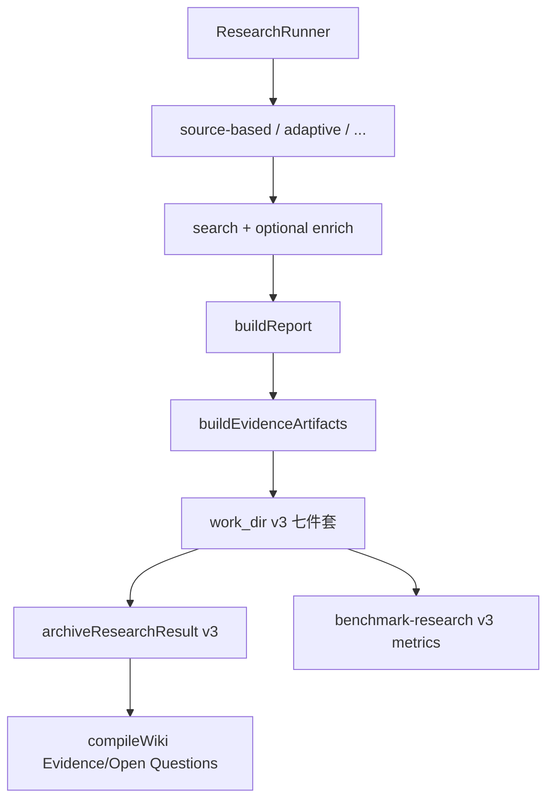

# Adaptive Research 与 Evidence Schema v3：有界控制与 claim 证据链

> 日期：2026-07-12
> 项目：js-deepresearch-agent / js-deepresearch-engine / js-wiki-engine / js-intel-store
> 类型：架构设计 / 功能实现 / 调研分析
> 来源：Cursor Agent 对话（PR #1 实现与真实环境验证）
> PR：[Add adaptive research and evidence schema v3](https://github.com/imjszhang/js-deepresearch-agent/pull/1)
> 分支：`agent/deep-research-schema-v3-adaptive` → `master`

---

## 目录

1. [背景与动机](#1-背景与动机)
2. [方案设计](#2-方案设计)
3. [实现要点](#3-实现要点)
4. [验证与测试](#4-验证与测试)
5. [真实调研对比](#5-真实调研对比)
6. [已知限制与使用建议](#6-已知限制与使用建议)
7. [后续演化](#7-后续演化)

---

## 1. 背景与动机

在 `js-intel-store` 归档与 `js-wiki-engine` 编译管线落地之后，调研执行层仍存在两个缺口：

1. **固定轮次**：`source-based` / `rapid` / `parallel` 按配置迭代，无法在证据不足时提前停、也无法在预算内自适应扩缩。
2. **引用粒度停在 finding/source**：报告里的 claim 与可验证 passage 之间没有结构化链接，benchmark 与 Wiki 只能做 citation 存在性检查，难以评估「关键结论是否有直接证据」。

本轮在**不改变默认策略**、**不引入强制外部语义依赖**的前提下，补齐：

- 共享预算、查询记忆、来源多样性、运行时 gate、claim 对齐（全部 opt-in）
- 实验性 `adaptive` gap 驱动策略
- Artifact / Intel Store **Schema v3**（gaps、passages、claims、quality、trace）
- Benchmark 与 Wiki 对 v3 产物的读取与编译（Evidence / Open Questions 页）

---

## 2. 方案设计

### 2.1 关键决策

| 决策 | 选择 | 理由 |
| ---- | ---- | ---- |
| 默认策略 | 仍为 `source-based` | 避免行为突变；高成本能力默认关闭 |
| 控制开关持久化 | 不写入 SQLite；仅 CLI flag 单次覆盖 | 实验性参数不应污染长期配置 |
| Schema 版本 | v3 扩展四件套，保留 v2 读路径 | Intel import `--upgrade-existing` 可 idempotent 升级 |
| Passage 来源 | 优先 `summary \|\| content \|\| snippet` | 与 source-based deep reading 一致；无正文时 passages 可为空 |
| Adaptive | 独立策略，共享 budget / trace | 不污染既有 iterative pipeline |
| Wiki Evidence 页 | 由 claims + passages 确定性编译 | 无 LLM；与 manifest 增量 hash 对齐 |

### 2.2 数据流（Schema v3）



### 2.3 新增产物

| 文件 | 内容 |
| ---- | ---- |
| `gaps.json` | adaptive / 控制层识别的开放问题 |
| `passages.json` | 来源片段（正文或 snippet 切分） |
| `claims.json` | 报告 claim + `evidence[]` → passageId |
| `quality.json` | gate、flags、limitations、metrics、budget snapshot |
| `trace.json` | 结构化动作链（plan / search / evaluate_report / stop 等） |
| `meta.json` | `artifactSchemaVersion: 3` + 各路径指针 |

---

## 3. 实现要点

### 3.1 Engine 包（`packages/js-deepresearch-engine`）

| 模块 | 职责 |
| ---- | ---- |
| `budget-manager.mjs` | `maxSearchRequests` / `maxSourceReads` / `maxLlmTokens` / `reserveReportTokens` |
| `query-memory.mjs` | 归一化 query 去重，避免重复搜索 |
| `source-candidates.mjs` | URL 归一化、hostname 多样性、`maxPerHostname` |
| `evidence-chain.mjs` | passage 抽取、claim 对齐、verdict |
| `quality-gates.mjs` | pre-report gate、runtime evidence gate |
| `strategies/adaptive.mjs` | gap 驱动有界步数状态机 |
| `work-output.mjs` | 写入 v3 侧车文件 |

### 3.2 App 层

| 路径 | 变更 |
| ---- | ---- |
| `src/cli-utils.mjs` / `src/cli.mjs` | 预算与 v3 feature flags |
| `src/storage/intel-store.mjs` | `ARCHIVE_SCHEMA_VERSION = 3`，gaps/passages/claims/quality/trace data sources |
| `scripts/intel/import-work-dir-core.mjs` | `--upgrade-existing` 从旧产物派生 v3 |
| `scripts/benchmark/` | v3 claims/passage 指标、`--compare` |
| `packages/js-wiki-engine` | `Evidence/`、`Open Questions/` 增量编译与 lint |

### 3.3 常用 CLI（单次实验）

```bash
# 默认行为不变
node src/cli.mjs research "your query"

# Schema v3 证据链（推荐验证组合）
node src/cli.mjs research "your query in English" \
  --source-fetch-mode summary \
  --source-evidence-passages true \
  --source-claim-alignment true \
  --max-search-requests 8 \
  --max-source-reads 6

# 实验性 adaptive
node src/cli.mjs research "your query" \
  --strategy adaptive \
  --max-search-requests 6
```

---

## 4. 验证与测试

### 4.1 自动化

| 检查 | 结果 |
| ---- | ---- |
| `npm run lint` | 通过 |
| `npm test` | **173** 项全过 |
| `npm run build` | 通过 |

覆盖：预算、`QueryMemory`、来源多样性、passage/claim 链、`adaptive` trace、work_dir v3 写入、Intel 归档、Wiki Evidence 页、CLI flag 映射。

### 4.2 Mock 端到端

- `artifactSchemaVersion: 3`、`archiveSchemaVersion: 3` 正常
- `adaptive` trace：`assess → plan → draft → evaluate_report → finalize → stop`
- `intel import --dry-run` preview 含 gaps/passages/claims

### 4.3 环境

- LLM：`openai-compatible` → 局域网 `qwen3.6:27b-mlx`
- 搜索：SearXNG `http://127.0.0.1:8889`
- 执行：`node src/cli.mjs`（本地 `npm exec jdr` 存在 Permission denied，不影响功能）

---

## 5. 真实调研对比

### Run A — 仅 snippet（无 deep reading）

| 项 | 值 |
| ---- | ---- |
| researchId | `99c31bd4-d9a2-4e6c-98e8-66aa670e9b16` |
| 查询 | `local-first AI frameworks and research projects` |
| sources | 8 |
| passages | **0** |
| claims | 24 |
| keyClaimEvidenceCoverage | 0% |
| 结论 | 有引用与架构趋势报告；claim 对齐将 key claim 标为 `Unverified`（符合设计） |

### Run B — `summary` 抓取 + v3 开关

| 项 | 值 |
| ---- | ---- |
| researchId | `b529659a-54a4-4611-8dc4-20cf1401fa84` |
| 查询 | `local-first AI frameworks CRDT sync on-device LLM` |
| sources | 8 |
| passages | **15** |
| claims | 23 |
| supportedClaims（含 partial） | 28 |
| keyClaimEvidenceCoverage | **100%** |
| budget stopReason | `sourceReads`（4/4） |
| 结论 | CRDT 生态成熟 vs AI-native sync 缺口；sqlite-sync / Loro / Verity 等来源可追溯 |

产物目录：`work_dir/source-based/2026-07-12_133819/`

### 管线连通

- Intel：`passagesCount: 15`，`claimsCount: 23`，`archiveSchemaVersion: 3`
- Wiki：31 页，23 个 `Evidence/` 页
- Benchmark：`citationResolutionRate: 1.0`，`passageCount: 15`，`averageSourcesPerClaim: 1.70`

### 中文查询踩坑（环境，非 PR 缺陷）

SearXNG 对 `local-first AI 研究现状与代表性项目` 等中英混合 query 常返回 **0 条**；换纯英文 query 后搜索正常。中文调研需确认 SearXNG 引擎配置或主查询使用英文。

---

## 6. 已知限制与使用建议

| 现象 | 说明 |
| ---- | ---- |
| `passages=0` 且大量 `Unverified` | 未开 `--source-fetch-mode`；仅 snippet 无法切 passage |
| `quality.gate: pass_with_warnings` | key claim 无 direct evidence 时预期行为 |
| Wiki lint 断链 | 长标题来源文件名截断；历史数据问题 |
| `adaptive` 未做完整 live run | 单元测试与 mock 已通过；可按需补一轮 |
| v2 intel 升级 | `intel import --upgrade-existing`；不能从纯 snippet 伪造正文 passage |

---

## 7. 后续演化

1. **Live 验证 `adaptive`**：`--strategy adaptive` + 小预算真实 query。
2. **中文搜索稳定性**：SearXNG 引擎选型或 query 语言策略文档化。
3. **Passage 质量**：`summary` 模式下的 enrich 成功率与失败回退指标进 benchmark 面板。
4. **Web UI**：Research 页暴露预算与 v3 开关（`web/src/research.mjs` 已部分接入）。
5. **Wiki lint**：长标题 safe filename 与 wikilink 一致性改进（独立 PR）。

---

## 合并结论

PR #1 达到预期：**默认行为不变，opt-in 控制与 Schema v3 在真实调研中可验证**；Run B 证明 passage → claim 证据链与预算停止语义正确。合并至 `master` 并同步 GitHub。
